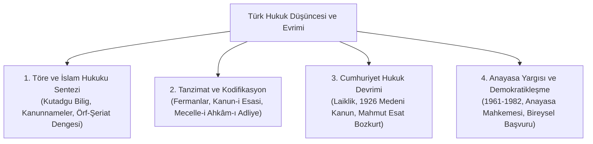

# 08 - Türk Hukuk Tarihi, Tanzimat ve Anayasal Evrim

> *"Adalet mülkün temelidir, mülk ise adalet ile kaimdir."*  
> — **Yusuf Has Hacib**, *Kutadgu Bilig (1069)*

---

## 📌 Genel Bakış ve Tarihsel Epistemoloji

Türk hukuk tarihi; Orta Asya bozkır töresinin yazısız dinamik normatif düzeninden başlayıp, İslam hukuku ile sentezlenen fıkıh ve örf ikiliğine, 19. yüzyıl Tanzimat modernleşmesi ve Mecelle kodifikasyonuna, nihayetinde Türkiye Cumhuriyeti'nin laik, rasyonel ve çağdaş hukuk devrimine uzanan benzersiz bir evrimsel patikaya sahiptir.

Bu modül; Türk hukuk düşüncesinin devlet felsefesi, adalet döngüsü, anayasacılık hareketleri ve kurumlar mimarisi eksenindeki dönüşümünü felsefi ve doktriner derinlikle ele almaktadır.

---

## 🏛️ Modül İçerik Haritası

---

## 📚 Kapsamlı Bölümler ve İncelemeler

1. **[Eski Türk Töresi ve İslam Hukuku Sentezi](01-eski-turk-toresi-ve-islam-hukuku-sentezi.md)**
   * Bozkır Töresi ve Orhun Abidelerindeki Hukuki İlkeler.
   * Kutadgu Bilig ve Meşhur "Adalet Döngüsü" (*Dâire-i Adliye*).
   * Şer'i Hukuk ve Örfi Hukuk İkiliği: Fatih ve Kanuni Kanunnameleri.
   * Kadılık Kurumu ve Yargı Bağımsızlığının Tarihsel Kökleri.

2. **[Tanzimat Dönemi ve Kodifikasyon: Mecelle-i Ahkâm-ı Adliye](02-tanzimat-ve-kanunilestirme-mecelle.md)**
   * Tanzimat Fermanı (1839) ve Can, Mal, Irz Güvenliği Teminatı.
   * Islahat Fermanı (1856) ve Tebaa Eşitliği.
   * Kanun-i Esâsî (1876): İlk Türk-Osmanlı Yazılı Anayasası.
   * Ahmet Cevdet Paşa ve Mecelle'nin 99 Temel Hukuk İlkesi (*Kavâid-i Külliye*).

3. **[Cumhuriyet Hukuk Devrimi ve Laikleşme](03-cumhuriyet-hukuk-devrimi-ve-laiklesme.md)**
   * 1921 Teşkilât-ı Esasîye ve 1924 Anayasası'nın Ruhî Temelleri.
   * 1926 Türk Kanunu Medenisi: İsviçre Medeni Kanununun İktibası ve Nedenleri.
   * Kadın Hakları, Şahıs Hukuku ve Mirasta Mutlak Eşitlik İlkesi.
   * Mahmut Esat Bozkurt ve İhtilal Hukuku Doktrini.

4. **[Türk Anayasa Yargısı ve Demokratikleşme Tarihi](04-turk-anayasa-yargisi-ve-demokratiklesme-tarihi.md)**
   * 1961 Anayasası ve Anayasa Mahkemesi'nin (*AYM*) Kuruluşu.
   * 1982 Anayasası: Otorite-Hürriyet Dengesi ve Reform Süreçleri.
   * 2010 Anayasa Değişikliği ve Bireysel Başvuru (*Constitutional Complaint*) Devrimi.
   * AYM'nin "Hak Eksenli" İçtihat Yaklaşımı ve Normlar Denetimi.

---

## 🔑 Temel Tarihsel Kavramlar Sözlüğü

* **Töre:** Eski Türklerde toplumsal ve siyasal hayatı düzenleyen, kağanın dahi üstünde olan bağlayıcı yazısız kurallar bütünü.
* **Dâire-i Adliye (Adalet Çemberi):** *"Devlet orduyla, ordu servetle, servet halkla, halk adaletle kaimdir"* aksiyomu.
* **Mecelle-i Ahkâm-ı Adliye:** Hanefi fıkhının borçlar, eşya ve usul hükümlerini modern kanun maddeleri halinde kodifiye eden ilk İslam-Osmanlı medeni kanunu (1869-1876).
* **Kavâid-i Külliye:** Mecelle'nin başında yer alan ve bugün de modern hukuk ilkeleriyle örtüşen 99 genel hukuk kaidesi (Örn: *Berâet-i zimmet asıldır* = Masumiyet karinesi).
* **İktibas (*Reception*):** Yabancı bir ülkenin kanun ve hukuk kurumlarının kendi hukuk düzenine sistemli biçimde aktarılması ve uyarlanması.
