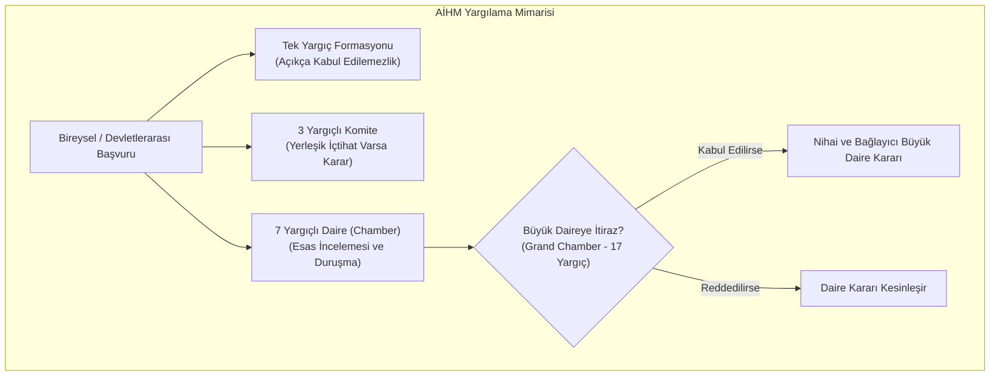
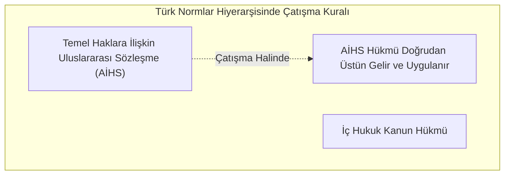

# Avrupa İnsan Hakları Sözleşmesi (AİHS) ve Mahkeme Sistemi (AİHM)

> *"Sözleşme; teorik ve hayali hakları değil, pratik ve etkili hakları korumayı amaçlayan yaşayan bir belgedir."*  
> — **AİHM**, *Airey v. İrlanda Kararı (1979)*

---

## 🏛️ 1. AİHS'in Doğuşu ve Hukuki Statüsü

1950 yılında Roma'da imzalanan ve 1953'te yürürlüğe giren **İnsan Haklarını ve Temel Özgürlükleri Koruma Sözleşmesi (AİHS)**; bireylere egemen devletlere karşı uluslararası bir yargı organı önünde hak arama yetkisi tanıyan tarihteki ilk ve en etkili uluslararası insan hakları sözleşmesidir.

---

## ⚖️ 2. AİHM Yargılamasının Üç Temel Doktrini

### A. İkincillik (*Subsidiarity*) İlkesi
* İnsan haklarını koruma ve ihlalleri giderme konusundaki **asıl ve birincil yükümlülük ulusal makamlara ve yerel mahkemelere** aittir.
* AİHM bir dördüncü derece temyiz mahkemesi (*fourth instance court*) değildir; yerel mahkemelerin delil değerlendirmesini veya maddi olay tespitini denetlemez. Yalnızca Sözleşme haklarının ihlal edilip edilmediğini inceler.
* Bu ilkenin sonucu olarak başvurucunun yerel yargı yollarını tamamen tüketmiş olması şarttır (*Exhaustion of Domestic Remedies*).

### B. Takdir Marjı (*Margin of Appreciation*) Doktrini
* Sözleşmeci devletlerin ulusal koşullarını, kültürel hassasiyetlerini ve kamu ahlakı dengelerini yerel hâkimler uluslararası bir yargıçtan daha iyi bilebilir (*Handyside v. Birleşik Krallık, 1976*).
* Bu nedenle AİHM; ifade özgürlüğü sınırları, din-devlet ilişkileri ve ahlak meselelerinde devlete belirli bir takdir alanı bırakır. Ancak bu alan sınırsız olmayıp AİHM'in Avrupa denetimine (*European supervision*) tabidir.

### C. Yaşayan Belge (*Living Instrument*) Doktrini
* AİHS 1950 yılındaki donuk anlamıyla değil; günümüzün değişen toplumsal, ahlaki ve teknolojik koşulları ışığında dinamik olarak yorumlanır (*Tyrer v. Birleşik Krallık, 1978*).
* Çevre hakkı, dijital mahremiyet, cinsiyet kimliği ve modern aile türleri bu dinamik yorum sayesinde AİHS koruma şemsiyesi altına alınmıştır.

---

## 📜 3. Türk Hukukunda AİHS'in Yeri (Anayasa Madde 90)

2004 yılında Anayasa'nın 90. maddesine eklenen son fıkra uyarınca:
> *"Usulüne göre yürürlüğe konulmuş temel hak ve özgürlüklere ilişkin milletlerarası andlaşmalarla kanunların aynı konuda farklı hükümler içermesi nedeniyle çıkabilecek uyuşmazlıklarda milletlerarası andlaşma hükümleri esas alınır."*

Bu hükümle birlikte Türk hâkimi; bir uyuşmazlıkta iç kanun maddesi ile AİHS hükmü çatıştığında kanunu bertaraf ederek doğrudan AİHS hükmünü uygulamakla yükümlü kılınmıştır.

---

## 🎯 AİHM Kararlarının İcrası ve Bakanlar Komitesi

AİHM kararları bağlayıcıdır (Madde 46). Kararların üye devlet tarafından yerine getirilmesi (bireysel önlemler: tazminat, iade-i muhakeme; genel önlemler: mevzuat değişikliği) **Avrupa Konseyi Bakanlar Komitesi** tarafından siyasi ve hukuki denetime tabi tutulur.
