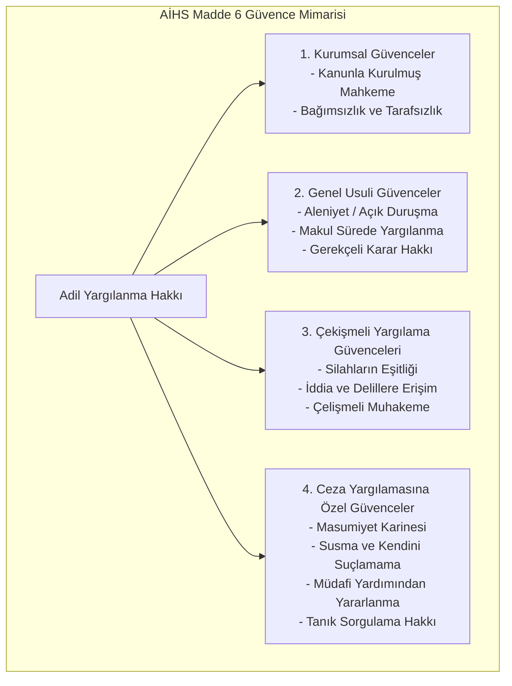
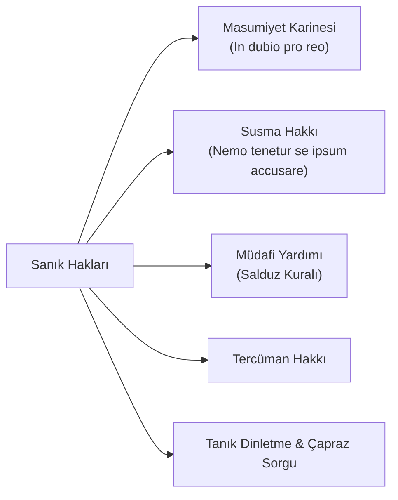

# Adil Yargılanma Hakkı ve Usuli Güvenceler (AİHS Madde 6)

> *"Adaletin yerine getirilmesi yetmez; aynı zamanda yerine getirildiğinin açıkça görülmesi de gerekir."*  
> — **Lord Hewart**, *R v Sussex Justices (1924)* — *"Justice must not only be done; it must also be seen to be done."*

---

## 🏛️ 1. Adil Yargılanma Hakkının Kapsamı ve Yapısı

AİHS Madde 6 ile güvenceye alınan **Adil Yargılanma Hakkı (*Right to a Fair Trial*)**, demokratik bir hukuk devletinin en temel kurucu taşıdır. Maddi hakların korunabilmesi, ancak usulün adil işlemesiyle mümkündür.

---

## ⚖️ 2. Temel Usuli Güvencelerin Analizi

### A. Silahların Eşitliği İlkesi (*Equality of Arms*)
* Davanın taraflarından birinin (özellikle ceza davasında sanığın, idare davasında vatandaşın), karşı tarafa (savcılık / idare) nazaran bariz dezavantajlı bir konuma düşürülmemesini ifade eder.
* Taraflar delillerini sunabilmeli, diğer tarafın sunduğu belgelere vakıf olabilmeli ve bunlara karşı etkili savunma yapabilmelidir.

### B. Çelişmeli Yargılama (*Contradictory Proceedings*)
* Hâkimin taraflarca tartışılmamış, tarafların görüş bildirmediği gizli raporlara veya bilirkişi mütalaalarına dayanarak hüküm kurması yasaktır. Her delil duruşmada tarafların tartışmasına açılmalıdır.

### C. Gerekçeli Karar Hakkı
* Mahkemeler, verdikleri kararların hukuki ve fiili dayanaklarını açıkça belirtmek zorundadır. Kararın gerekçeli olması; keyfiyeti önler, tarafları ikna eder ve üst mahkeme denetimini mümkün kılar.

### D. Makul Sürede Yargılanma Hakkı
* Hukuki belirsizliğin kişi üzerinde yarattığı baskıyı sonlandırmak amacıyla yargılamanın makul sürede bitirilmesi gerekir.
* Makul süre değerlendirmesinde 4 kriter esas alınır:
  1. Davanın karmaşıklığı.
  2. Başvurucunun tutum ve davranışları.
  3. İdari ve adli makamların tutumu (gecikmelerdeki payı).
  4. Uyuşmazlığın başvurucu açısından taşıdığı hayati önem (*neyin tehlikede olduğu*).

---

## 🛡️ 3. Ceza Yargılamasına Özgü Asgari Haklar (Madde 6/2 ve 6/3)

### 1. Masumiyet Karinesi (*Presumption of Innocence*)
* Suçluluğu mahkeme hükmüyle sabit oluncaya kadar herkes masumdur. İspat yükü iddia makamına aittir; şüphenin varlığı halinde beraat kararı verilir.

### 2. Nemo Tenetur İlkesi (Kendini Suçlamama ve Susma Hakkı)
* Hiç kimse kendi aleyhine tanıklık yapmaya veya kendisini suçlayıcı beyanda bulunmaya zorlanamaz. Zorla, tehditle veya işkenceyle alınan ikrarlar hukuken geçersiz ve hükümsüzdür (*Zehirli Ağacın Meyvesi Doktrini*).

### 3. Salduz Doktrini (*Avukata Erişim Güvencesi*)
* AİHM'in tarihi *Salduz v. Türkiye (2008)* kararı uyarınca; şüphelinin polisteki ilk ifadesinden itibaren bir avukat yardımından yararlandırılması şarttır. Müdafi olmaksızın alınan ikrar, mahkûmiyet kararına tek başına esas teşkil edemez.

---

## 🎯 Sonuç

Adil yargılanma hakkı; suçluyu aklama aracı değil, masumun haksız yere cezalandırılmasını önleyen ve adaletin toplum nezdindeki itibar ve meşruiyetini tesis eden en hayati güvencedir.
