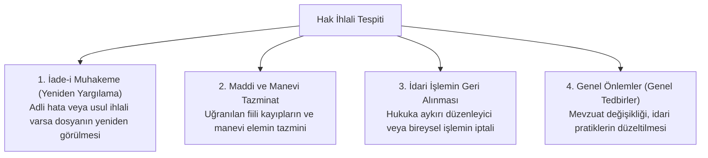
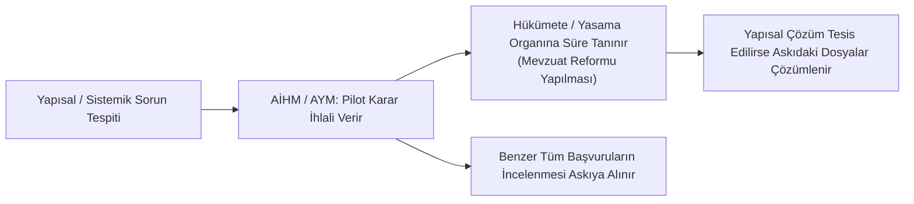

# İnsan Hakları İhlallerinde Yargısal Telafi, Pilot Karar ve İade-i Muhakeme

> *"İhlalin tespit edilmesi başlangıçtır; asıl adalet, ihlalin sonuçlarının bütünüyle ortadan kaldırılması (*restitutio in integrum*) ile tecelli eder."*

---

## 🏛️ 1. İhlalin Giderilmesi: *Restitutio in Integrum* İlkesi

Uluslararası insan hakları hukukunda ve anayasa yargısında temel kural; mağdurun ihlal gerçekleşmemiş olsaydı bulunacağı duruma getirilmesidir (*Eski Hale Getirme / Restitutio in Integrum*).

---

## ⚖️ 2. Pilot Karar Usulü (*Pilot-Judgment Procedure*)

Pilot Karar Rejimi; aynı yapısal ve sistemik aksaklıktan kaynaklanan binlerce benzer başvurunun mahkemeleri kilitlemesini önlemek amacıyla geliştirilmiş stratejik bir usul mekanizmasıdır (*Broniowski v. Polonya, 2004*).

### Pilot Kararın Ayırt Edici Özellikleri:
1. İhlalin münferit bir olaydan değil, **yapısal bir mevzuat boşluğundan** veya **yerleşik idari uygulamadan** kaynaklandığını tespit eder.
2. Devlete sorunu çözmesi için genel bir çerçeve ve belirli bir süre verir.
3. Sorun çözülürse askıdaki diğer binlerce başvuru iç hukukta kurulan tazminat/uzlaşma komisyonlarına devredilir.

---

## 📜 3. Türk Hukukunda İade-i Muhakeme (Yeniden Yargılama) Yolu

AİHM veya AYM'nin hak ihlali tespit etmesi halinde; Türk Hukuk Muhakemeleri Kanunu (HMK m. 375), Ceza Muhakemesi Kanunu (CMK m. 311) ve İdari Yargılama Usulü Kanunu (İYUK m. 53) uyarınca **Yeniden Yargılama** talep edilebilir:

* **Süre:** AİHM/AYM kararının kesinleştiği tarihten itibaren **1 yıl** içinde talepte bulunulmalıdır.
* **Mahkemenin Rolü:** İlk derece mahkemesi, ihlal kararının gerekçesini gözeterek yeniden duruşma açmak ve ihlali ortadan kaldıracak yeni bir karar vermekle yükümlüdür.

---

## 🎯 Sonuç

Yargısal telafi mekanizmaları; kâğıt üzerindeki anayasal hakları canlı, yaptırımlı ve müeyyideli kılan köprülerdir. Hak ihlalinin tespitiyle yetinilmeyip ihlalin tüm sonuçlarıyla tasfiye edilmesi, gerçek bir hukuk devletinin asgari standardıdır.
