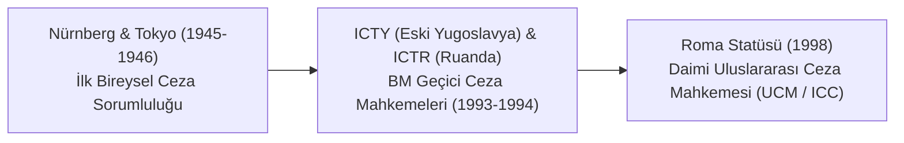
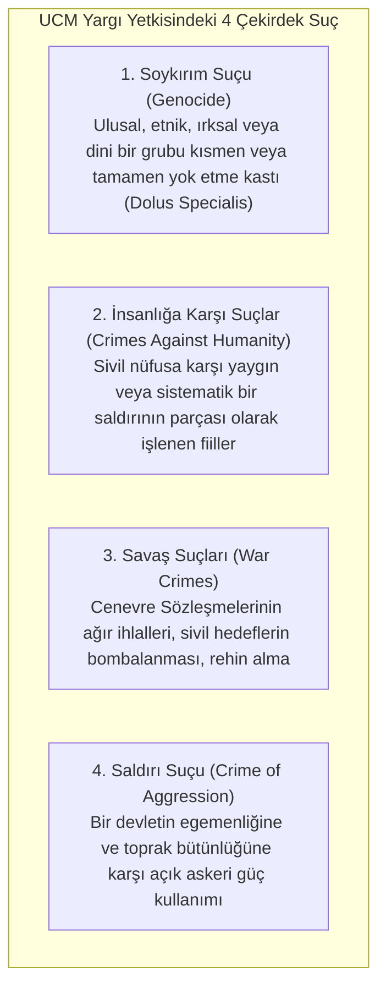

# Uluslararası Ceza Adaleti, Roma Statüsü ve İnsanlığa Karşı Suçlar

> *"Devletler soyut varlıklardır; insanlığa karşı suçları işleyenler ise etten ve kemikten gerçek bireylerdir. Adalet, bu bireylerin yargılanmasını emreder."*  
> — **Nürnberg Uluslararası Askeri Ceza Mahkemesi Gerekçeli Kararı (1946)**

---

## 🏛️ 1. Uluslararası Ceza Hukukunun Tarihsel Doğuşu

Uluslararası ceza hukuku; devlet egemenliği ardına sığınarak kitlesel katliam, soykırım ve vahşet uygulayan yöneticilerin cezasız kalmasını (*impunity*) engellemek amacıyla doğmuştur.

---

## ⚖️ 2. Roma Statüsü ve Dört Çekirdek Suç (*Core Crimes*)

17 Temmuz 1998'de kabul edilen ve Lahey'de kurulan Uluslararası Ceza Mahkemesi (ICC / UCM), 4 evrensel suç üzerinde yargı yetkisine sahiptir:

---

## 🛡️ 3. Temel Yargılama Prensipleri

### A. Tamamlayıcılık (*Complementarity*) İlkesi
* UCM, ulusal mahkemelerin yerine geçmez. Öncelikle yetki suçun işlendiği veya şüphelinin vatandaşı olduğu devlete aittir.
* UCM yalnızca devlet yargılama yapmaktan **isteksiz (*unwilling*)** veya **yargılama yapamaz durumda (*unable*)** ise devreye girer.

### B. Resmi Sıfatın Önemsizliği (Madde 27)
* Devlet başkanı, başbakan, bakan veya general olmak cezai sorumluluğu ortadan kaldırmaz ve cezayı hafifletici sebep sayılamaz. Mutlak devlet bağışıklığı bu suçlar için geçerli değildir.

### C. Komuta Sorumluluğu (*Command Responsibility*)
* Askeri komutanlar ve sivil amirler; emirleri altındaki birliklerin insanlığa karşı suç işlediğini bildikleri veya bilmeleri gerektiği halde bunu önlememişlerse bizzat sorumlu tutulurlar.

### D. Zamanaşımı Yasağı (Madde 29)
* Roma Statüsü kapsamındaki çekirdek suçlarda **zamanaşımı işlemez (*Statute of Limitations Does Not Apply*)**. Failler kaç yıl geçerse geçsin yargılanabilir.

---

## 🌍 4. Evrensel Yargı Yetkisi (*Universal Jurisdiction*)

Evrensel yargı ilkesine göre bazı suçlar (işkence, soykırım, insanlığa karşı suçlar) insanlığın ortak vicdanını yaraladığı için; fail veya mağdur kendi vatandaşı olmasa ve suç kendi ülkesinde işlenmemiş olsa dahi, faili ele geçiren herhangi bir devletin mahkemesi o kişiyi yargılama yetkisine sahiptir.

---

## 🎯 Sonuç

Uluslararası ceza hukuku; gücün hakka galip gelmesini engellemek, tiranların hukuksuz eylemlerine küresel yaptırım uygulamak ve gelecek nesiller için kalıcı bir barış ve adalet düzeni tesis etmek için kurulmuş küresel bir vicdan kalkanıdır.
