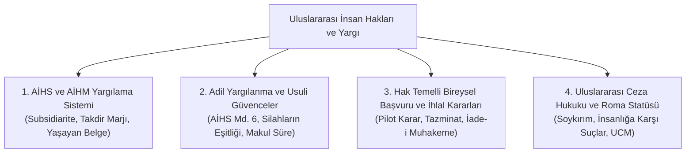

# 09 - Uluslararası İnsan Hakları Hukuku ve Yargısal Koruma

  

> *"Bütün insanlar hür, haysiyet ve haklar bakımından eşit doğarlar."*  
> — **İnsan Hakları Evrensel Beyannamesi (1948)**, *Madde 1*

> *"Injustice anywhere is a threat to justice everywhere."*  
> *(Herhangi bir yerdeki adaletsizlik, her yerdeki adalete yönelmiş bir tehdittir.)*  
> — **Martin Luther King Jr.**, *Letter from Birmingham Jail (1963)*

> *"Evrensel insan hakları nerede başlar? Haritalarda görünmeyecek kadar küçük mekânlarda: Evin içinde, sokakta, okulda veya fabrikada... Eğer bu haklar oralarda bir anlam taşımıyorsa, hiçbir yerde geçerli olamazlar."*  
> — **Eleanor Roosevelt**, *Birleşmiş Milletler (1958)*

> *"En temel insan hakkı; hak talep edebilme hakkına (the right to have rights) sahip olmaktır."*  
> — **Hannah Arendt**, *The Origins of Totalitarianism (1951)*

---

## 📌 Genel Bakış ve Normatif Çerçeve

II. Dünya Savaşı'nın yol açtığı büyük yıkım ve Holokost trajedisi; devletlerin kendi vatandaşlarına yönelik eylemlerinin salt bir "iç egemenlik meselesi" sayılamayacağını, insan haklarının uluslararası toplumun ortak güvencesi altında olması gerektiğini ortaya koymuştur.

Bu modül; Birleşmiş Milletler İnsan Hakları rejimi, Avrupa İnsan Hakları Sözleşmesi (AİHS) ve Mahkemesi (AİHM), Adil Yargılanma Hakkının usuli güvenceleri, ulusal ve uluslararası bireysel başvuru mekanizmaları ile Roma Statüsü ekseninde Uluslararası Ceza Mahkemesi (UCM) sistemini kapsamlı biçimde incelemektedir.

---

## 🏛️ Modül İçerik Haritası

---

## 📚 Kapsamlı Bölümler ve İncelemeler

1. **[AİHS ve Avrupa İnsan Hakları Mahkemesi Sistemi](01-aihs-ve-avrupa-insan-haklari-mahkemesi-sistemi.md)**
   * Avrupa Konseyi, Sözleşme Mimarisi ve Koruma Sistemi.
   * İkincillik (*Subsidiarity*) İlkesi ve Yerel Yolların Tüketilmesi Kuralı.
   * Takdir Marjı Doktrini (*Margin of Appreciation*).
   * Sözleşmenin Dinamik Yorumu: "Yaşayan Belge" (*Living Instrument*) İlkesi.

2. **[Adil Yargılanma Hakkı ve Usuli Güvenceler (AİHS Madde 6)](02-adil-yargilanma-hakki-ve-usuli-guvenceler.md)**
   * Bağımsız ve Tarafsız Mahkemede Yargılanma Hakkı.
   * Silahların Eşitliği (*Equality of Arms*) ve Çekişmeli Yargılama.
   * Kendini Suçlamama (*Nemo Tenetur*) ve Susma Hakkı.
   * Gerekçeli Karar ve Makul Sürede Yargılanma Güvencesi.

3. **[İnsan Hakları İhlallerinde Yargısal Telafi ve Pilot Karar Rejimi](03-insan-haklari-ihlallerinde-yargisal-telafi-ve-pilot-karar.md)**
   * AİHM İhlal Kararlarının Hukuki Sonuçları (Madde 46).
   * Pilot Karar Usulü (*Pilot-Judgment Procedure*) ve Yapısal Sorunların Çözümü.
   * Türk Hukukunda İade-i Muhakeme (Yeniden Yargılama) Yolu.
   * Adil Tatmin (*Just Satisfaction*) ve Manevi Tazminat Kriterleri.

4. **[Uluslararası Ceza Adaleti, Roma Statüsü ve İnsanlığa Karşı Suçlar](04-uluslararasi-ceza-adaleti-ve-insanliga-karsi-suclar.md)**
   * Nürnberg ve Tokyo Mahkemelerinden Uluslararası Ceza Mahkemesi'ne (*ICC*).
   * Roma Statüsü'nün 4 Çekirdek Suçu: Soykırım, İnsanlığa Karşı Suçlar, Savaş Suçları, Saldırı Suçu.
   * Evrensel Yargı Yetkisi (*Universal Jurisdiction*) ve Cezasızlıkla Mücadele (*Impunity*).
   * Komuta Sorumluluğu (*Command Responsibility*) ve Devlet Başkanlığı Dokunulmazlığının Sınırları.

---

## 🔑 Temel Latince ve Uluslararası Hukuk Kavramları

* **Jus Cogens:** Uluslararası hukukun hiçbir şekilde aksine işlem yapılamayan, emredici evrensel kuralları (İşkence yasağı, kölelik yasağı, soykırım yasağı).
* **Erga Omnes:** Bütün devletlere ve tüm insanlığa karşı ileri sürülebilen yükümlülükler.
* **Non-Refoulement:** İşkence, insanlık dışı veya onur kırıcı muamele görme tehlikesi olan bir ülkeye sığınmacının geri gönderilmesi yasağı.
* **Ne Bis In Idem:** Aynı fiilden dolayı bir kimsenin birden fazla yargılanamayacağı ve cezalandırılamayacağı ilkesi.
* **Margin of Appreciation:** AİHM'in, milli kültür, kamu ahlakı ve toplumsal hassasiyetler gerektiren konularda ulusal makamlara tanıdığı takdir yetkisi.
