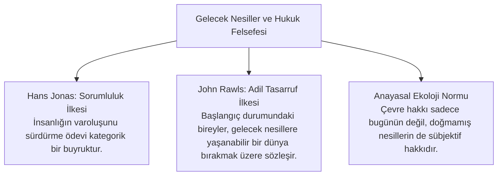

# İklim Adaleti, Gelecek Nesiller ve Anayasal Yükümlülükler

> *"Bugün karbon bütçesini tüketmek; yarın yaşayacak olan gençlerin ve doğmamış nesillerin hürriyet ve yaşam haklarını ipotek altına almaktır."*  
> — **Alman Federal Anayasa Mahkemesi**, *Neubauer v. Almanya Kararı (2021)*

---

## 🌍 1. Kuşaklararası Adalet (*Intergenerational Justice*) Teorisi

Geleneksel hukuk felsefesi hak ve ödevleri yaşayan bireyler arasındaki yatay ilişkide tanımlarken; iklim krizi hukuku **dikey / zamansal boyutta** düşünmeye zorlamıştır.

---

## ⚖️ 2. Dünyayı Değiştiren Emsal İklim Kararları

### A. *Neubauer ve Diğerleri v. Almanya* (BVerfGE, 2021)
* **Olay:** Genç iklim aktivistleri, Almanya Federal İklim Koruma Kanunu'nun 2030 sonrasına ertelediği sera gazı azaltım hedeflerinin, gelecekte kendilerine aşırı bir kısıtlama getireceğini ileri sürerek iptal davası açtı.
* **Hüküm:** Mahkeme, kanunun mevcut nesle aşırı karbon harcama imkanı tanıyarak gelecek nesillerin **neredeyse tüm temel hak ve özgürlüklerini** orantısız kısıtlama riski doğurduğuna hükmetmiş ve kanunu iptal etmiştir.
* **Hukuki İlke:** *"Nesiller arası özgürlük güvencesi"* (*Intertemporale Freiheitssicherung*).

### B. *Urgenda v. Hollanda Krallığı* (Hollanda Yüksek Mahkemesi, 2019)
* **Olay:** Urgenda Vakfı ve 900 vatandaş, devletin sera gazı salınımlarını yeterince azaltmayarak AİHS Madde 2 (Yaşam Hakkı) ve Madde 8 (Özel Hayata Saygı) kapsamındaki pozitif yükümlülüklerini ihlal ettiğini savundu.
* **Hüküm:** Yüksek Mahkeme, devletin iklim değişikliğinin yıkıcı risklerine karşı vatandaşlarının yaşam hakkını korumak için 2020 sonuna kadar emisyonları %25 azaltmak zorunda olduğuna kesin hükmetti.

---

## 📜 3. Anayasa ve Çevre Hakkı (Madde 56)

Türkiye Cumhuriyeti Anayasası Madde 56:
> *"Herkes, sağlıklı ve dengeli bir çevrede yaşama hakkına sahiptir. Çevreyi geliştirmek, çevre sağlığını korumak ve çevre kirlenmesini önlemek Devletin ve vatandaşların ödevidir."*

Anayasa bu hükümle hem devlete pozitif ödev yüklemiş hem de çevre korumayı bireyler için anayasal bir sorumluluk kılmıştır.

---

## 🎯 Sonuç

İklim adaleti; kalkınma hakkı ile gelecek kuşakların var olma hakkı arasındaki dengenin rasyonel, bilimsel ve anayasal güvencelerle kurulmasıdır.
