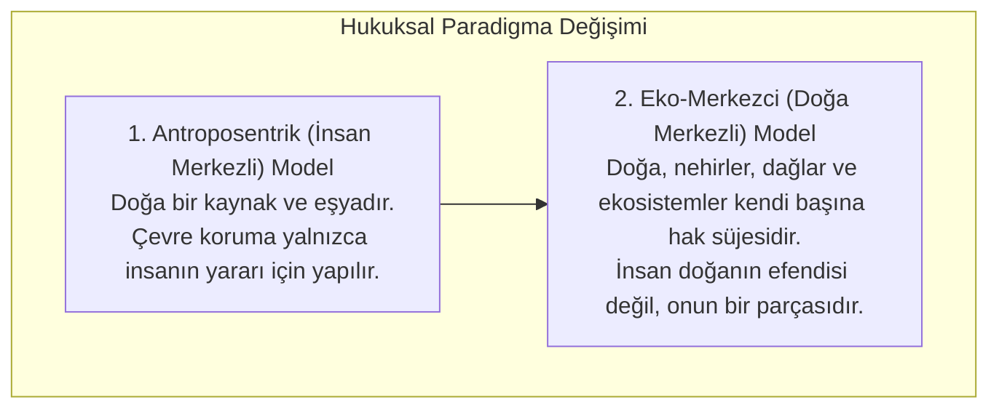
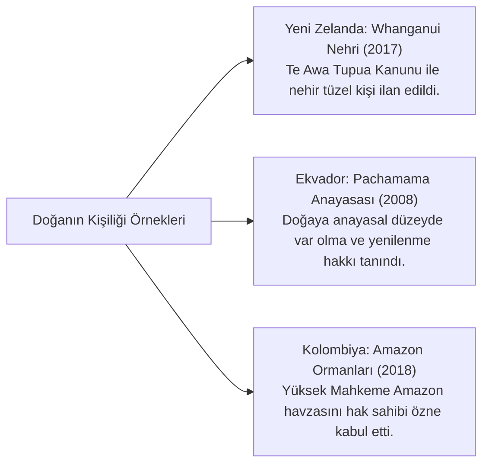

# Eko-Merkezci Hukuk Kuramı ve Doğaya Tüzel Kişilik Tanınması

> *"Hukuk tarihi boyunca her yeni hak talebi, başlangıçta düşünülemez ve saçma görünmüştür: Kölelerin, kadınların, çocukların ve yabancıların hak sahibi olması gibi... Ağaçların, nehirlerin ve ormanların dava ehliyeti olması da böyledir."*  
> — **Christopher D. Stone**, *Should Trees Have Standing? (1972)*

---

## 🌲 1. Paradigma Değişimi: Antroposentrizmden Eko-Merkezciliğe

Modern hukuk sistemleri Roma hukukundan bu yana varlıkları ikiye ayırmıştır: **Kişiler (Hak Süjeleri)** ve **Eşyalar (Hak Objeleri)**. Doğa geleneksel olarak mülkiyetin nesnesi olan bir "eşya" sayılmıştır.

---

## ⚖️ 2. Doğaya Tüzel Kişilik Tanıyan Küresel Uygulamalar

### A. Whanganui Nehri (*Te Awa Tupua*) Modeli (Yeni Zelanda)
* Maori yerlilerinin nehri kutsal ve yaşayan bir ata kabul etmesi üzerine parlamento, nehre bağımsız bir **tüzel kişilik (*legal personhood*)** tanımıştır.
* Nehrin haklarını savunmak üzere Maori kabilesi temsilcisi ve devlet temsilcisinden oluşan ortak bir vasi (*guardian*) kurulu atanmıştır.

### B. Ekvador Anayasası (*Toprak Ana / Pachamama Hakları*)
* Ekvador 2008 Anayasası Madde 71: *"Pachamama (Toprak Ana), yaşamsal döngülerinin, yapısının ve evrimsel süreçlerinin bütünlüğüne saygı duyulması hakkına sahiptir."*
* Herhangi bir vatandaş, doğa adına mahkemelerde dava açma ehliyetine kavuşturulmuştur.

---

## 🛡️ 3. Hayvan Hakları ve Hissedebilir Varlık (*Sentient Being*) Doktrini

* Hayvanların salt eşya değil; acı, elem ve sevinç hissedebilen duyarlı varlıklar (*sentient beings*) olduğu kabul edilmektedir (Lizbon Anlaşması Madde 13, Türk Hayvanları Koruma Kanunu 2021 reformu).
* Cansız varlıklar ve hayvanlar adına dava açılması, vesayet ve kayyımlık hukuku ilkelerinin çevreye uyarlanmasıyla işlemektedir.

---

## 🎯 Sonuç

Doğaya hak süjeliği tanınması; insanın gezegen üzerindeki sınırsız tahakkümünü sınırlandıran ve hukuku türler arası bir barış sözleşmesine dönüştüren devrimci bir felsefi adımdır.
