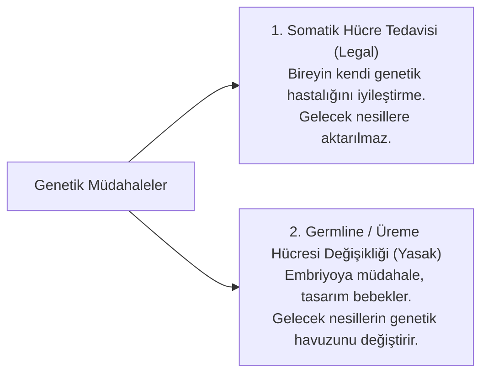

# Biyoetik Hukuku, Genetik Müdahaleler ve İnsan Onuru

> *"İnsanın biyolojik varlığı ve genetik mirası; piyasa ekonomisinin veya teknolojik hırsın bir metaı haline getirilemez."*  
> — **Avrupa Konseyi Oviedo Biyoetik Sözleşmesi (1997)**

---

## 🧬 1. Biyoetik Hukukunun Kapsamı ve İnsan Onuru İlkesi

Biyomedikal bilimlerin gelişmesiyle birlikte doğum, yaşam, genetik yapı ve ölüm süreçleri insan müdahalesine açık hale gelmiştir. Biyoetik hukuku; bilimin sınırlarını **insan onuru (*human dignity*)** ve **bedensel bütünlük** ilkeleri çerçevesinde çizer.

```mermaid
flowchart TD
    subgraph Biyoetik Hukukunun 4 Temel İlkesi (Beauchamp & Childress)
        A["1. Özerkliğe Saygı (Autonomy)<br>Aydınlatılmış onam ve kendi geleceğini belirleme"]
        B["2. Yararlılık (Beneficence)<br>Hastanın iyiliği ve sağlığının gözetilmesi"]
        C["3. Zarar Vermeme (Non-maleficence)<br>Primum non nocere (Önce zarar verme)"]
        D["4. Adalet (Justice)<br>Sağlık kaynaklarının hakkaniyetli dağılımı"]
    end
```

---

## 🔬 2. Genetik Müdahaleler ve CRISPR-Cas9 Sınırları

Genom düzenleme teknolojileri iki ana alanda kullanılır ve hukuki rejimleri birbirinden tamamen farklıdır:



### Oviedo Biyoetik Sözleşmesi (Madde 13) Kuralı:
* İnsan genomunu değiştirmeyi amaçlayan herhangi bir müdahaleye, yalnızca **önleyici, teşhis edici veya tedavi edici amaçlarla** ve **sonraki nesillerin genetik yapısında değişiklik yapmamak kaydıyla** izin verilebilir.
* İnsan klonlama (üreme amaçlı) mutlak olarak yasaklanmıştır.

---

## ⚖️ 3. Ötenazi, Yaşamı Destekleme ve Yaşam Hakkı İkilemi

Hukuk felsefesinin en çetin etik tartışmalarından biri "Onurlu Ölüm Hakkı" ile "Devletin Yaşamı Koruma Görevi" arasındaki gerilimdir:

1. **Aktif Ötenazi:** Hekimin ölümcül bir madde enjekte ederek hastanın hayatını sonlandırması (Hollanda, Belçika, Kanada gibi sınırlı ülkelerde sıkı şartlarla yasal; Türk Ceza Kanunu'nda kasten öldürme suçu sayılır).
2. **Pasif Ötenazi / Tedaviyi Reddetme:** Hastanın rızasıyla suni solunum, diyaliz veya ilaç tedavisinin kesilmesi (Özerklik ilkesi kapsamında birçok hukuk düzeninde kabul görmektedir).
3. **Aydınlatılmış Onam (*Informed Consent*):** Kişinin vücudu üzerinde yapılacak her türlü tıbbi operasyona özgür iradesiyle, riskleri bilerek rıza göstermesi kuralıdır. Rızasız müdahale kasten yaralama suçunu oluşturur.

---

## 🎯 Sonuç

Biyoetik hukuku; insanı laboratuvarların kobayı olmaktan koruyan, bilim ile etik arasında adalet terazisini kuran koruyucu bir kalkandır.
