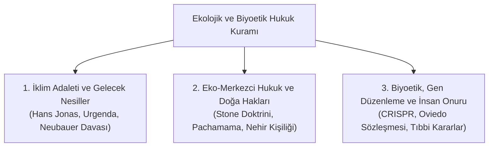

# 10 - Çevre Hukuku, Gelecek Nesiller ve Biyoetik

> *"Öyle hareket et ki, eylemlerinin etkileri yeryüzünde hakiki bir insan hayatının devamlılığı ile bağdaşabilsin."*  
> — **Hans Jonas**, *Sorumluluk İlkesi (Das Prinzip Verantwortung, 1979)*

> *"Ağaçların dava ehliyeti olmalı mıdır? Hukuk tarihi, eskiden hak sahibi sayılmayan varlıkların (köleler, kadınlar, tüzel kişiler) zamanla hak süjesi haline gelme tarihidir."*  
> — **Christopher D. Stone**, *Should Trees Have Standing? (1972)*

> *"Bugünün nesli, kendi özgürlüklerini koruma adına gelecek kuşakların yaşam ve özgürlük alanını tüketemez. Anayasa gelecek nesilleri de korur."*  
> — **Alman Federal Anayasa Mahkemesi (BVerfG)**, *Neubauer İklim Kararı (2021)*

---

## 📌 Genel Bakış: Antroposen Çağında Hukuk Felsefesi

21. yüzyılda insanlığın teknolojik ve endüstriyel kapasitesi, gezegenin ekolojik dengesini ve bizzat insan biyolojisini dönüştürecek boyutlara ulaşmıştır. Bu durum geleneksel antroposentrik (insan merkezli) hukuk teorilerini yetersiz kılmış; **Ekolojik Hukuk Devleti**, **Kuşaklararası Adalet** ve **Biyoetik Hukuk** gibi yeni ontolojik alanlar doğurmuştur.

Bu modül; iklim davalarını, gelecek kuşakların anayasal haklarını, doğanın ve cansız varlıkların tüzel kişiliğini ve genetik düzenlemeler ile biyoetiğin sınırlarını incelemektedir.

---

## 🏛️ Modül İçerik Haritası

---

## 📚 Kapsamlı Bölümler ve İncelemeler

1. **[İklim Adaleti ve Gelecek Nesillere Karşı Sorumluluk](01-iklim-adaleti-ve-gelecek-nesillere-sorumluluk.md)**
   * Hans Jonas'ın "Gelecek Etiği" ve Rawls'ın Kuşaklararası Tasarruf İlkesi.
   * *Neubauer v. Almanya (2021)* Federal Anayasa Mahkemesi Kararı: Geleceğin Özgürlük Haklarının Şimdiden Korunması.
   * *Urgenda v. Hollanda (2019)*: Devletin Yaşam Hakkı Çerçevesinde Emisyon Azaltma Pozitif Yükümlülüğü.
   * Paris İklim Anlaşması ve Uluslararası Yaptırımlar.

2. **[Eko-Merkezci Hukuk ve Doğaya Tüzel Kişilik Tanınması](02-eko-merkezci-hukuk-ve-dogaya-kisilik-taninmasi.md)**
   * Antroposentrik (İnsan Merkezli) Hukuktan Eko-Merkezci (Doğa Merkezli) Hukuka Geçiş.
   * Christopher Stone: "Ağaçların Dava Ehliyeti Olmalı mı?" (*Should Trees Have Standing?*).
   * Yeni Zelanda Whanganui Nehri (*Te Awa Tupua*) ve Hindistan Ganj Nehri Kararları.
   * Ekvador Anayasası (2008) ve *Pachamama* (Toprak Ana) Hakları.

3. **[Biyoetik Hukuku, Genetik Müdahale ve İnsan Onuru](03-biyoetik-genetik-hukuk-ve-insan-onuru.md)**
   * Oviedo Biyoetik Sözleşmesi ve İnsan Genomunun Dokunulmazlığı.
   * CRISPR-Cas9 ve İnsan Embriyosunda Gen Modifikasyonu Tartışmaları (*Tasarım Bebekler*).
   * Ötenazi, Yaşamı Destekleyen Tedavilerin Kesilmesi ve Kendi Geleceğini Belirleme Hakkı.
   * Tıbbi Müdahalelerde Aydınlatılmış Onam (*Informed Consent*) ve Kişisel Bütünlük.

---

## 🔑 Temel Ekolojik ve Biyoetik Kavramlar

* **İhtiyat İlkesi (*Precautionary Principle*):** Bilimsel kesinliğin bulunmadığı hallerde, telafisi imkansız bir çevre veya sağlık felaketi riskine karşı önleyici tedbir alma zorunluluğu.
* **Kirleten Öder İlkesi (*Polluter Pays Principle*):** Çevreye zarar veren eylemlerin ekonomik ve hukuki maliyetinin kirletici tarafından karşılanması.
* **Kuşaklararası Eşitlik (*Intergenerational Equity*):** Gezegen kaynaklarının gelecek kuşakların yaşam hakkını tehlikeye atmayacak biçimde sürdürülebilir kullanılması.
* **İnsan Genomu Dokunulmazlığı:** İnsan türünün genetik havuzunu kalıcı biçimde değiştirecek eylemlerin ve üreme amaçlı klonlamanın kesin olarak yasaklanması.
