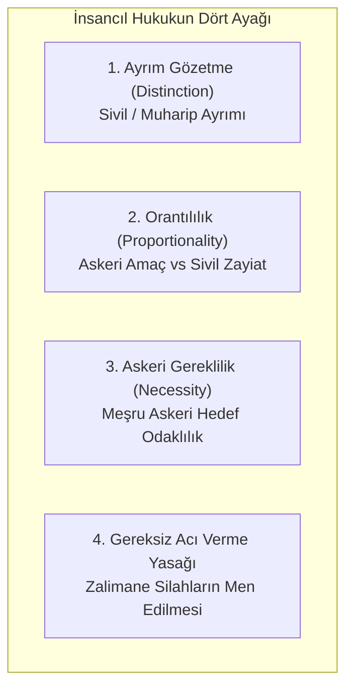

# Cenevre Sözleşmeleri ve Silahlı Çatışmalar Hukuku

> *"Savaşın da kanunları vardır; vahşet meşrulaştırılamaz."*  
> — **Jean-Jacques Rousseau**, *Toplum Sözleşmesi*

---

## 🏛️ 1. Tarihsel Arka Plan ve Kodifikasyon

Modern Uluslararası İnsancıl Hukukun (*IHL - International Humanitarian Law*) temelleri, Henry Dunant'ın 1859 Solferino Muharebesi'ndeki yaralı askerlerin dramına tanık olmasıyla atılmıştır. Dunant'ın *Un Souvenir de Solférino* (1862) adlı eseri, Kızılhaç Teşkilatı'nın kurulmasına ve 1864 tarihli ilk Cenevre Sözleşmesi'ne öncülük etmiştir.

1949 yılında İkinci Dünya Savaşı'nın yıkıcı felaketlerinin ardından dört ana Cenevre Sözleşmesi kabul edilmiştir:

1. **I. Cenevre Sözleşmesi:** Karadaki Silahlı Kuvvetlerin Yaralı ve Hastalarının Durumunun İyileştirilmesi.
2. **II. Cenevre Sözleşmesi:** Denizdeki Silahlı Kuvvetlerin Yaralı, Hasta ve Kazazedelerinin Durumunun İyileştirilmesi.
3. **III. Cenevre Sözleşmesi:** Savaş Esirlerine (*POW - Prisoners of War*) Yapılacak Muamele.
4. **IV. Cenevre Sözleşmesi:** Savaş Zamanında Sivil Kişilerin Korunması.

1977 yılında kabul edilen **I. ve II. Ek Protokoller** ile uluslararası ve uluslararası olmayan silahlı çatışmalarda koruma alanı daha da genişletilmiştir.

---

## ⚖️ 2. Temel İlkeler ve Normatif Standartlar

### A. Ayrım Gözetme İlkesi (*Distinction*)
* I. Ek Protokol Madde 48 uyarınca taraflar her zaman sivil nüfus ile muharipler arasında ve sivil mallar ile askeri hedefler arasında ayrım yapmak zorundadır.
* Şüphe halinde bir kişinin veya yapının (örneğin okul, ibadethane, hastane) sivil olduğu kabul edilir (*Presumption of Civilian Status*).

### B. Orantılılık İlkesi (*Proportionality*)
* Bir askeri operasyonun, doğrudan ve somut beklenen askeri avantaja oranla aşırı miktarda sivil can kaybına, yaralanmasına veya sivil yapı hasarına yol açacağı öngörülüyorsa icra edilmesi yasaktır (Ek Protokol I, Madde 51/5-b).

### C. Ortak Madde 3: İnsani Asgari Standart (*Mini-Sözleşme*)
Dört Cenevre Sözleşmesi'nin ortak 3. maddesi, uluslararası nitelikte olmayan iç çatışmalarda dahi geçerli olan evrensel asgari insan hakları güvencelerini düzenler:
* Yaşama kastetme ve katletme yasağı,
* İşkence, zalimane ve aşağılayıcı muamele yasağı,
* Rehin alma yasağı,
* Bağımsız ve tarafsız bir mahkeme kararı olmaksızın ceza verme veya infaz etme yasağı.

---

## 🛡️ 3. Martens Klozu ve Kamu Vicdanı

1899 Lahey Barış Konferansı'nda Rus delege Friedrich Martens tarafından önerilen ve uluslararası hukukun mihenk taşı haline gelen **Martens Klozu**, pozitif düzenlemelerin boşluklarında bile hukukun devrede olduğunu vurgular:

$$\text{Koruma Normu} = \text{Teamül Hukuku} + \text{İnsanlık Kanunları} + \text{Kamu Vicdanının Gerekleri}$$

Bu ilke, modern çağda yapay zekâlı otonom silahlar ve yeni nesil harp teknolojileri karşısında hukuki ve ahlaki bir koruma kalkanı sağlamaktadır.
