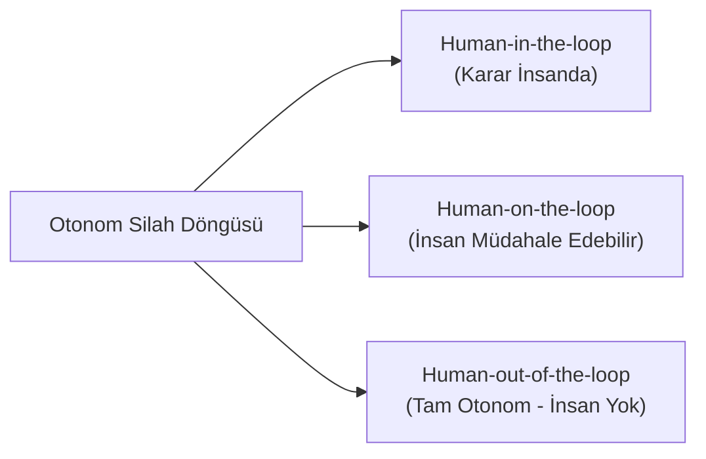

# Asimetrik Savaş, Siber Harp ve Otonom Silahlar

> *"Makineler hedef seçip can aldığında, insan onuru ve hukuki sorumluluk mekanizması çöker."*

---

## 🤖 1. Ölümcül Otonom Silah Sistemleri (LAWS) ve Hukuk

**Lethal Autonomous Weapons Systems (LAWS)**; insan müdahalesi veya onayı olmaksızın hedef tespit eden, seçen ve öldürücü güç uygulayan yapay zekâ destekli sistemlerdir (*Katil Robotlar / Swarm Drones*).

### Hukuki ve Etik Sorunlar:
1. **Anlamlı İnsan Kontrolü (*Meaningful Human Control*):** Cenevre Sözleşmeleri Ek Protokol I Madde 36, yeni silahların geliştirilmesinde uluslararası hukuka uygunluk incelemesi yapılmasını emreder. Bir algoritmanın sivil ile muharip arasındaki nüansı (*Ayrım Gözetme*) veya teslim olma iradesini (*Hors de combat*) idrak etmesi teknik olarak imkansızdır.
2. **Ceza Sorumluluğu Boşluğu (*Accountability Gap*):** Bir yapay zekâ sivil katliamı gerçekleştirdiğinde fail kimdir? Yazılımcı mı, komutan mı, üretici şirket mi yoksa devlet mi? Roma Statüsü'ndeki şahsi ceza sorumluluğu ilkesi sarsılmaktadır.
3. **İnsan Onuru (*Human Dignity*):** Bir insanın yaşam veya ölüm kararının bir algoritmanın sayısal çıktılarına (olasılık matrisine) indirgenmesi, Kantçı insan onuru ilkesinin açık ihlalidir.

---

## 💻 2. Siber Harp ve Tallinn Manueli

Siber uzay (*Cyberspace*), kara, deniz, hava ve uzaydan sonra savaşın beşinci harekât alanı (*5th domain*) olarak kabul edilmiştir.

### Tallinn Manueli 2.0 (2017):
NATO Siber Savunma Mükemmeliyet Merkezi tarafından hazırlanan bu çalışma, uluslararası hukukun siber operasyonlara nasıl uygulanacağını ortaya koyar:
* **Egemenlik İlkesi:** Bir devletin bilişim altyapısına izinsiz dış müdahale egemenliğin ihlalidir.
* **Kuvvet Kullanımı (BM Şartı Md. 2/4):** Bir siber saldırı, fiziksel bir yıkım, can kaybı veya nükleer santral/baraj çöküşü gibi ağır sonuçlar doğuruyorsa, bu eylem "kuvvet kullanma" ve "silahlı saldırı" (*armed attack*) sayılır.
* **Meşru Müdafaa (BM Şartı Md. 51):** Ağır siber saldırıya maruz kalan devlet, meşru müdafaa hakkı kapsamında konvansiyonel veya siber yollarla orantılı karşılık verebilir.
