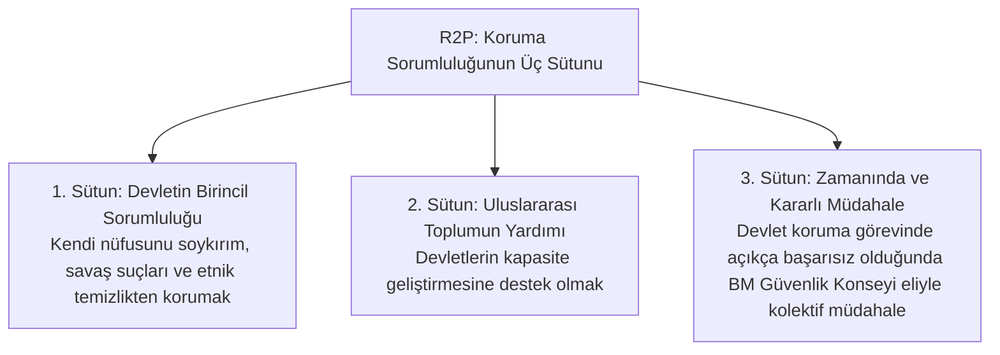

# Hibrit Tehditler ve İnsani Müdahale Doktrini

> *"Devlet egemenliği bir dokunulmazlık zırhı değil, halkını koruma sorumluluğudur."*

---

## 🛡️ 1. Koruma Sorumluluğu (Responsibility to Protect - R2P)

Geleneksel Westphalia egemenlik anlayışında devlet, kendi sınırları içinde mutlak egemendir. Ancak 1990'lardaki Ruanda soykırımı ve Srebrenitsa katliamı, uluslararası toplumun egemenlik karşısındaki eylemsizliğini sorgulatmıştır.

2005 BM Dünya Zirvesi'nde kabul edilen **R2P Doktrini**, egemenliği bir "ayrıcalık" değil, bir "sorumluluk" olarak yeniden tanımlamıştır:

---

## ⚖️ 2. Haklı Savaş Teorisi (Bellum Justum) ve Şartları

Orta Çağ'dan (Aquinas, Vitoria, Grotius) modern uluslararası hukuka uzanan **Haklı Savaş Teorisi**, askeri gücün ancak belirli katı kriterlerin varlığı halinde meşru sayılabileceğini savunur:

1. **Haklı Neden (*Just Cause*):** Saldırganlığı püskürtmek, soykırımı durdurmak.
2. **Meşru Otorite (*Legitimate Authority*):** Yetkili kurum (BM Güvenlik Konseyi veya meşru devlet organı) kararı.
3. **Doğru Niyet (*Right Intention*):** Çıkar, işgal veya intikam değil, barış ve adaleti tesis etme amacı.
4. **Son Çare Olma (*Last Resort*):** Diplomatik, ekonomik ve siyasi tüm barışçıl yolların tüketilmiş olması.
5. **Orantılılık (*Proportionality*):** Müdahalenin getireceği faydanın, sebep olacağı yıkımdan fazla olması.
6. **Başarı İhtimali (*Reasonable Prospect of Success*):** Kaosa ve daha büyük katliamlara yol açmama güvencesi.

---

## ⚔️ 3. BM Güvenlik Konseyi Vetosu ve Meşruiyet Çıkmazı

BM Şartı 27/3 uyarınca daimi 5 üyenin (P5: ABD, Rusya, Çin, İngiltere, Fransa) sahip olduğu veto yetkisi, kitlesel insan hakları ihlallerinde Güvenlik Konseyi'nin kilitlenmesine yol açmaktadır.

Bu kriz karşısında:
* **"Barış İçin Birlik" Kararı (A/RES/377 A):** Güvenlik Konseyi'nin kilitlendiği hallerde BM Genel Kurulu'nun tavsiye niteliğinde kolektif tedbirler alabilmesi,
* **Sorumluluktan Kaçınmama Kodu:** Kitlesel zulüm suçlarında veto hakkının kullanılmaması yönündeki ahlaki ve hukuki baskılar tartışılmaktadır.
