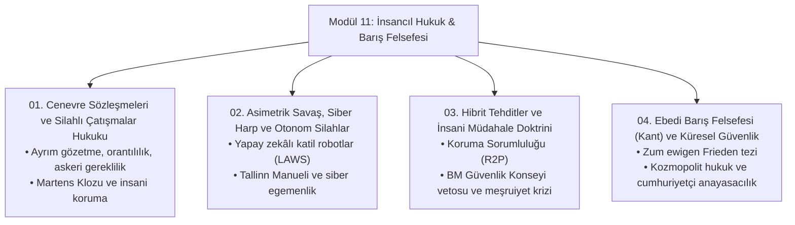

# Modül 11: Uluslararası İnsancıl Hukuk, Savaş Hukuku ve Barış Felsefesi

> *"Inter arma enim silent leges." (Savaşta yasalar susar.)*  
> — **Marcus Tullius Cicero**, *Pro Milone*  
>
> *"Savaşta bile yasalar susmamalıdır; zira insanlık onuru cephede de korunmalıdır."*  
> — **Hugo Grotius**, *De Jure Belli ac Pacis (1625)*

---

## 📌 Modülün Kapsamı ve Amacı

Bu modül; savaşın meşruiyeti (*Ius ad Bellum*), savaş sırasında uyulması gereken insani kurallar (*Ius in Bello*), savaş sonrası adalet (*Ius post Bellum*) ve kalıcı küresel barış felsefesini incelemektedir. 1949 Cenevre Sözleşmeleri'nden otonom silah sistemlerine (LAWS), siber harp doktrinlerinden Kant'ın *Ebedi Barış* kuramına kadar geniş bir epistemolojik ve normatif perspektif sunar.

---

## 📂 İnceleme Başlıkları ve Dosya Haritası

| No | Doküman | Temel Doktrinler & Odak Alanları |
|---|---|---|
| **01** | [Cenevre Sözleşmeleri ve Silahlı Çatışmalar Hukuku](01-cenevre-sozlesmeleri-ve-silahli-catismalar-hukuku.md) | *Ius in Bello*, 1949 Dört Cenevre Sözleşmesi ve Ek Protokoller, Ayrım Gözetme İlkesi (*Distinction*), Askeri Gereklilik, Gereksiz Acı Verme Yasağı, *Martens Klozu*. |
| **02** | [Asimetrik Savaş, Siber Harp ve Otonom Silahlar](02-asimetrik-savas-siber-harb-ve-otonom-silahlar.md) | Otonom Silah Sistemleri (*Lethal Autonomous Weapons - LAWS*), Anlamlı İnsan Kontrolü (*Meaningful Human Control*), Tallinn Manueli 2.0, Kritik Altyapılara Siber Saldırılar. |
| **03** | [Hibrit Tehditler ve İnsani Müdahale Doktrini](03-hibrit-tehditler-ve-insani-mudahale-doktrini.md) | Koruma Sorumluluğu (*Responsibility to Protect - R2P*), Soykırım ve Etnik Temizliği Önleme, BM Şartı 2(4) ve 51. Madde, Haklı Savaş Teorisi (*Just War Theory*). |
| **04** | [Ebedi Barış Felsefesi (Kant) ve Küresel Güvenlik](04-ebedi-baris-felsefesi-kant-ve-kuresel-guvenlik.md) | Immanuel Kant'ın *Zum ewigen Frieden* (1795) Manifestosu, Cumhuriyetçi Anayasa, Serbest Milletler Federasyonu (*Foedus Pacificum*), Kozmopolit Hukuk ve Misafirperverlik Hakkı. |

---

## ⚖️ İnsancıl Hukukun Dört Kurucu İlkesi

1. **Ayrım Gözetme İlkesi (*Distinction*):** Savaşanlar (*combattants*) ile siviller (*non-combattants*) ve askeri hedefler ile sivil mülkler arasında mutlak ayrım yapılması zorunludur.
2. **Orantılılık İlkesi (*Proportionality*):** Beklenen askeri kazanç ile sivil can kaybı ve hasar arasında ölçülü bir denge bulunmalıdır; sivil zayiat aşırı olamaz.
3. **Askeri Gereklilik (*Military Necessity*):** Sadece düşmanı etkisiz hale getirmek için zorunlu olan güç kullanılabilir; yıkım ve şiddet amaç haline getirilemez.
4. **Gereksiz Istırap Verme Yasağı (*Prohibition of Unnecessary Suffering*):** Aşırı acı, kalıcı sakatlık veya acımasız ölüme sebep olan mühimmatların (kimyasal, biyolojik, parçalanan mermiler) kullanımı yasaktır.

---

## 🕊️ Martens Klozu (1899 Lahey Sözleşmesi)

> *"Yazılı kuralların öngörmediği hallerde bile; halklar ve savaşanlar, yerleşik teamüllerden, insanlık kanunlarından ve kamu vicdanının gereklerinden doğan uluslararası hukuk ilkelerinin koruması ve hâkimiyeti altındadır."*
