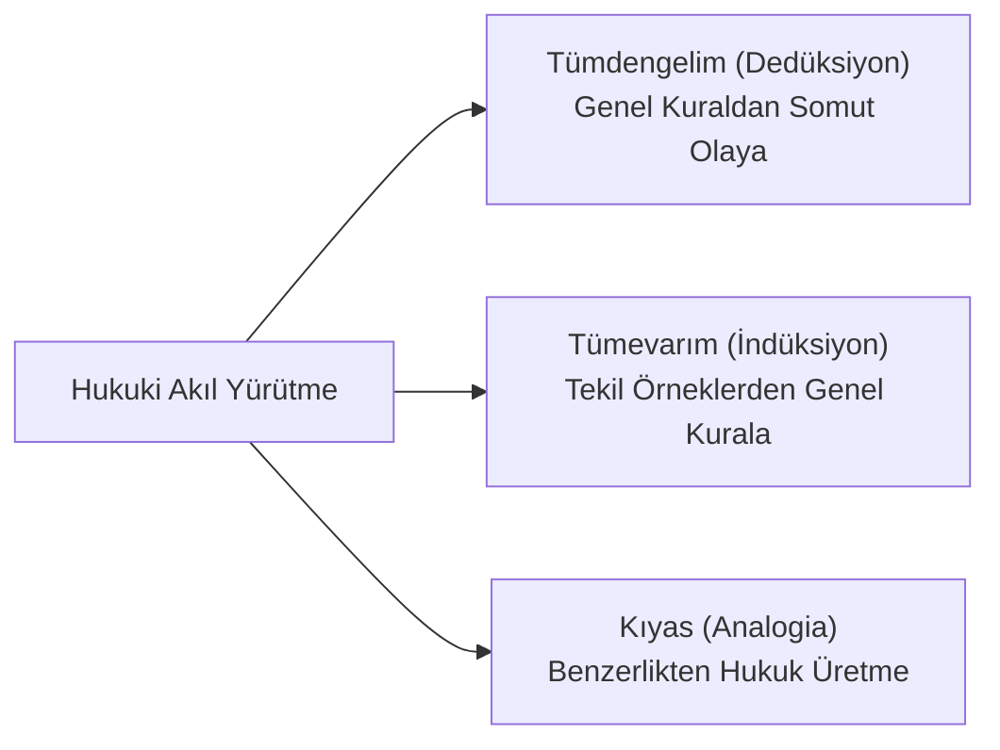

# Hukuk Mantığı ve Yargısal Tasım (Justizsyllogismus)

> *"Hukuki düşünce, mantığın zarafeti ile adaletin vicdanı arasındaki köprüdür."*

---

## 🏛️ 1. Klasik Yargısal Tasım (Dedüksiyon)

Hukuk uygulamasının omurgasını oluşturan yargısal tasım (*Justizsyllogismus*), genel ve soyut bir hukuk kuralının somut bir olaya uygulanarak tekil bir hükme varılması sürecidir:

```
[Büyük Önerme (Obersatz)] : Her kim hırsızlık yaparsa, TCK m. 141 uyarınca 1 yıldan 3 yıla kadar hapis cezası verilir.
[Küçük Önerme (Untersatz)]: Sanık A, mağdur B'nin rızası olmaksızın taşınır malını zilyetliğine geçirmiştir (Olay hırsızlık tipine uygundur).
---------------------------------------------------------------------------------------------------------------------
[Hüküm / Sonuç (Schlusssatz)]: O halde Sanık A hakkında 1 yıldan 3 yıla kadar hapis cezası uygulanmalıdır.
```

---

## 🔍 2. Mantıksal Akıl Yürütme Türleri



### Temel Argümantasyon Formları:
1. **Kıyas (*Argumentum a Simili / Analogia*):** Kanunun benzer bir duruma bağladığı hukuki sonucu, hakkında kural bulunmayan benzer olaya uygulama (*Örn: Medeni Kanun m. 1/2*). Ceza hukukunda sanık aleyhine kıyas yasaktır.
2. **Mefhum-u Muhalif (*Argumentum a Contrario*):** Bir kuralın açıkça saydığı istisnalar dışında kalan durumlar için zıt sonucun geçerli olduğunu çıkarma (*Örn: "Yalnızca resmi nikahlı eşler nafaka talep edebilir" -> Resmi nikahı olmayanlar talep edemez*).
3. **Evleviyet (*Argumentum a Fortiori*):**
   * *A maiore ad minus (Çoğu yapmaya yetkili olan, azı da yapabilir):* Taşınmazı satmaya yetkili vekil, onu kiraya da verebilir.
   * *A minore ad maius (Azı yasak olanın, çoğu öncelikle yasaktır):* Parkta çiçek koparmak yasaksa, ağacı kökünden sökmek evleviyetle yasaktır.
