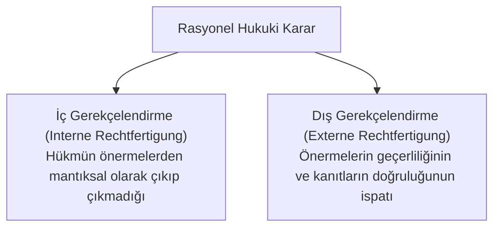

# Robert Alexy Argümantasyon Kuramı ve Söylem Analizi

> *"Hukuki söylem, genel pratik söylemin sınırlanmış özel bir halidir."*  
> — **Robert Alexy**, *A Theory of Legal Argumentation*

---

## 🗣️ 1. Özel Durum Tezi (Sonderfallthese)

Robert Alexy, hukuki argümantasyonun genel ahlaki/felsefi tartışmalardan tamamen bağımsız olmadığını savunur. Hukuki tartışma, **Genel Pratik Söylemin Özel Bir Hali** (*Sonderfall*) dir. 

Farkı şudur: Hukuki söylemde "ne ahlaken en iyidir?" sorusu değil, "yürürlükteki pozitif hukuk, anayasa ve emsal kararlar çerçevesinde ne doğrudur ve meşrudur?" sorusu yanıtlanır.

---

## 📜 2. İç ve Dış Gerekçelendirme Ayrımı

### 1. İç Gerekçelendirme (*Interne Rechtfertigung*):
* Kararın formel mantık kurallarına uygunluğunu denetler. 
* Eğer büyük ve küçük önermeler doğru kabul edilirse, varılan sonuç mantıksal zorunlulukla takip ediyor mu?

### 2. Dış Gerekçelendirme (*Externe Rechtfertigung*):
* Kullanılan önermelerin (kanun maddesi yorumu, içtihat, delillerin güvenilirliği) rasyonel olarak haklılaştırılmasıdır.
* Burada yorum kuralları (lafzi, sistematik, tarihi, teleolojik), emsal kararlar ve genel pratik ilkeler devreye girer.

---

## ⚖️ 3. Doğruluk İddiası (Anspruch auf Richtigkeit)

Alexy'ye göre her yargısal karar ve her yasa, doğası gereği bir **doğruluk ve haklılık iddiası** (*claim to correctness*) taşır. 

Örneğin bir mahkeme:
> *"Sanığın masum olduğunu bilmemize rağmen, onu 10 yıl hapse mahkum ediyoruz."*

şeklinde bir karar verirse, bu karar yalnızca ahlaken değil, kavramsal ve kurumsal olarak da **hukuken sakattır ve iflas etmiştir**. Doğruluk iddiası hukukun kurucu unsurudur.
