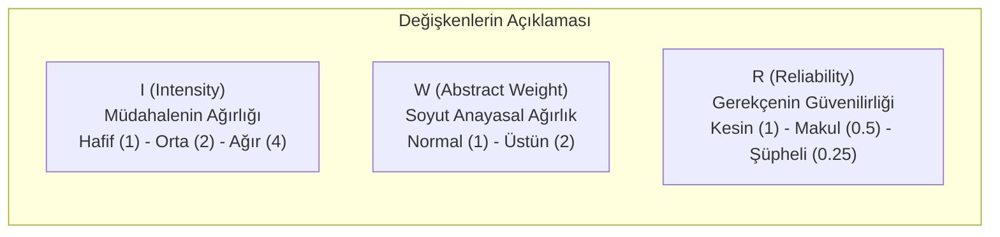

# Ağırlık Formülü ve Haklar Dengesi (Weight Formula)

> *"Bir ilkeye yapılan müdahalenin ağırlığı arttıkça, diğer ilkenin tatmin edilmesinin önemi de o oranda artmalıdır."*  
> — **Robert Alexy**, *Tartma Yasası (Gesetz des Abwägens)*

---

## 🧮 1. Kurallarla İlkeler Arasındaki Fark

Robert Alexy'nin temel haklar teorisindeki en devrimci ayrım, **Kurallar (*Regeln*)** ile **İlkeler (*Prinzipien*)** arasındaki yapısal farktır:

* **Kurallar:** *"Ya hep ya hiç"* (*All-or-Nothing*) niteliğindedir. Bir kural ya uygulanır ya da uygulanmaz.
* **İlkeler:** **Optimizasyon Emirleridir (*Optimierungsgebote*)**. Hukuki ve fiili imkanlar ölçüsünde en yüksek derecede gerçekleştirilmesi gereken değerlerdir. Çatıştıklarında biri diğerini geçersiz kılmaz; somut olayda tartılırlar (*Balancing / Abwägung*).

---

## ⚖️ 2. Ağırlık Formülü Matematiksel Modeli

Alexy, temel hak çatışmalarında (örn. İfade Özgürlüğü $P_i$ ile Kişilik Hakları $P_j$) mahkemenin keyfilikten uzaklaşması için şu orantılılık ve ağırlık formülünü geliştirmiştir:

$$W_{i,j} = \frac{I_i \cdot W_i \cdot R_i}{I_j \cdot W_j \cdot R_j}$$

### Karar Kriteri:
* Eğer $W_{i,j} > 1$ ise: $P_i$ ilkesi somut olayda önceliklidir ($P_i \mathbf{P} P_j$).
* Eğer $W_{i,j} < 1$ ise: $P_j$ ilkesi somut olayda önceliklidir ($P_j \mathbf{P} P_i$).
* Eğer $W_{i,j} = 1$ ise: Yapısal takdir alanı (*strukturelles Ermessen*) oluşur; kanun koyucunun veya hâkimin takdir yetkisi devreye girer.

---

## 🛡️ 3. Somut Uygulama Örneği

**Olay:** Bir gazetenin yolsuzluk iddiasıyla bir bakan hakkında yaptığı haber:
* $P_i$ (Halkın Haber Alma / Basın Özgürlüğü): Müdahale engellenirse basın özgürlüğü **Ağır ($I_i=4$)** zedelenir. Bilgi belgeli ve güvenilirdir ($R_i=1$).
* $P_j$ (Bakanın Kişilik Hakkı ve Şerefi): Haber doğruysa müdahale **Hafif ($I_j=1$)** veya makuldür.

$$W_{i,j} = \frac{4 \cdot 1 \cdot 1}{1 \cdot 1 \cdot 1} = 4 > 1$$

Sonuç: Basın özgürlüğü üstün gelir, haber yasaklanamaz.
