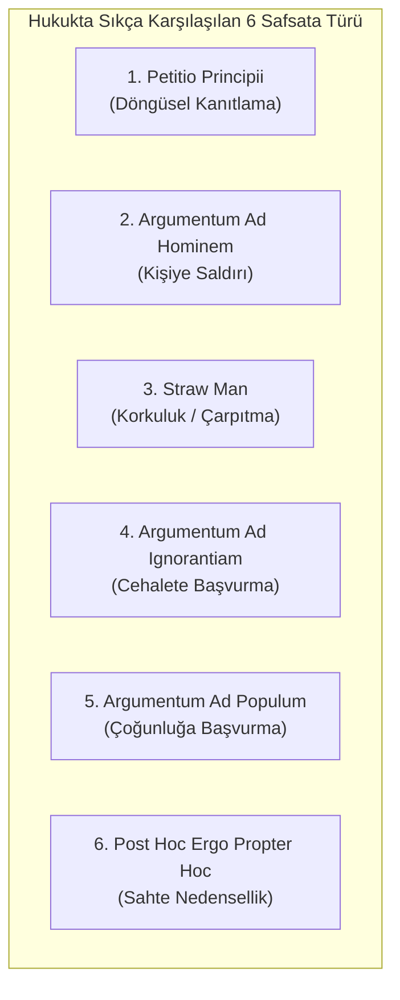

# Hukuki Yanılsamalar ve Mantıksal Safsatalar (Fallacies in Legal Reasoning)

> *"Bir argümanın kusuru, sadece mantığın değil, aynı zamanda adaletin de zedelenmesidir."*

---

## 🚫 1. Yargı Kararlarında ve Savunmalarda Mantıksal Hatalar

Hukuki muhakeme sürecinde gerekçelerin mantıksal geçerliliğini bozan yanıltıcı akıl yürütmelere **hukuki safsata (*fallacy*)** denir. Bunlar hem avukat savunmalarında hem de hâkim gerekçelerinde kararı hukuken sakatlar.

---

## 📚 2. Temel Safsata Türleri ve Hukuki Örnekler

### 1. Petitio Principii (Döngüsel Akıl Yürütme / Begging the Question)
* **Tanım:** İspatlanması gereken iddiayı, kanıtın önermesi olarak kullanmak.
* **Hukuki Örnek:** *"Bu delil hukuka aykırıdır, çünkü polis bunu yasaya aykırı şekilde elde etmiştir."* (Neden hukuka aykırı olduğu açıklanmaksızın aynı iddia tekrarlanmaktadır).

### 2. Argumentum Ad Hominem (Kişiye Saldırı)
* **Tanım:** Karşı tarafın sunduğu argümanın içeriğini çürütmek yerine şahsiyetine, ahlakına veya geçmişine saldırmak.
* **Hukuki Örnek:** *"Bilirkişi geçmişte disiplin cezası almıştır, dolayısıyla sunduğu teknik rapor geçersizdir."* (Raporun bilimsel içeriği denetlenmelidir).

### 3. Straw Man (Korkuluk Safsatası)
* **Tanım:** Karşı tarafın savunduğu tezi aşırı uçlara çekip karikatürize ederek çürütmeye çalışmak.
* **Hukuki Örnek:** *"Savunma makamı polisin yetkilerini sınırlamak istiyor; yani sokakların suçlulara teslim edilmesini savunuyorlar!"*

### 4. Argumentum Ad Ignorantiam (Cehalete / Bilinmezliğe Başvurma)
* **Tanım:** Bir şeyin yanlışlığının kanıtlanamamış olmasını, onun doğruluğuna kanıt saymak.
* **Ceza Hukukunda Önemi:** Masumiyet karinesinin zıddıdır. *"Sanık o saatte evde olduğunu ispatlayamamıştır, o halde suç mahallindedir."* Bu çıkarım mutlak bir safsatadır; zira ispat yükü iddia makamındadır.

### 5. Argumentum Ad Populum (Çoğunluğun Önyargısına Başvurma)
* **Tanım:** Toplumun genel kanısının veya öfkesinin hukuki doğruluğun ölçütü olduğunu iddia etmek.
* **Hukuki Örnek:** *"Tüm kamuoyu bu kişinin suçlu olduğunu biliyor ve idamını istiyor, mahkeme ceza vermelidir."* (Hâkim popüler hezeyanlara değil kanuna ve vicdani kanaatine uyar).

### 6. Post Hoc Ergo Propter Hoc (Zamansal Ardışıklığı Nedensellik Sanma)
* **Tanım:** B olayının A olayından sonra gerçekleşmiş olmasını, doğrudan A'nın B'ye sebep olduğu şeklinde yorumlamak.
* **Hukuki Örnek:** Haksız fiil veya tıbbi malpraktis davalarında illiyet bağının somut bilimsel kanıtlar yerine sadece kronolojiye dayandırılması.
