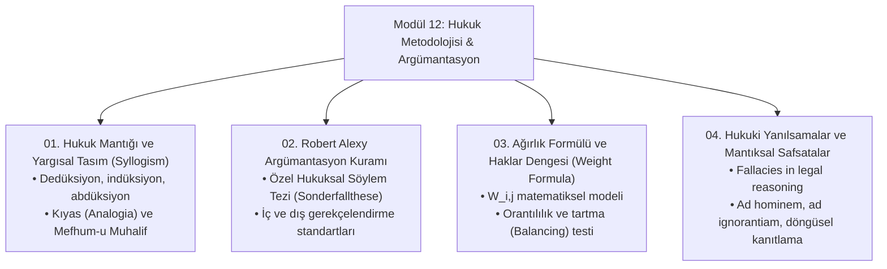

# Modül 12: Hukuk Metodolojisi, Mantık ve Yargısal Argümantasyon

> *"Hukuki karar verme yalnızca bir kanun uygulama eylemi değil; rasyonel, gerekçelendirilmiş ve denetlenebilir bir söylemsel muhakeme sürecidir."*  
> — **Robert Alexy**, *Theorie der juristischen Argumentation (1978)*

---

## 📌 Modülün Kapsamı ve Amacı

Bu modül; hukuki muhakemenin epistemolojik temellerini, klasik ve modern hukuk mantığını (yargısal tasım, kıyas, mefhum-u muhalif), Robert Alexy'nin söylem teorisi ve ağırlık formülünü ($W_{i,j}$), Toulmin argümantasyon modelini ve mahkeme kararlarında yapılan mantıksal safsataları (*legal fallacies*) derinlemesine inceler.

---

## 📂 İnceleme Başlıkları ve Dosya Haritası

| No | Doküman | Temel Doktrinler & Odak Alanları |
|---|---|---|
| **01** | [Hukuk Mantığı ve Yargısal Tasım (Syllogism)](01-hukuk-mantigi-ve-tullesim-kurali-syllogism.md) | Yargısal Tasım (*Justizsyllogismus*), Büyük Önerme (*Norm*), Küçük Önerme (*Somut Olay*), Sonuç (*Hüküm*), *Argumentum a contrario*, *Argumentum a fortiori* (*a maiore ad minus, a minore ad maius*). |
| **02** | [Robert Alexy Argümantasyon Kuramı](02-alexy-argumantasyon-kurami-ve-soylem-analizi.md) | Özel Durum Tezi (*Sonderfallthese*), Rasyonel Pratik Söylem Kuralları, Doğruluk ve Haklılık İddiası (*Anspruch auf Richtigkeit*), İç ve Dış Gerekçelendirme. |
| **03** | [Ağırlık Formülü ve Haklar Dengesi (Weight Formula)](03-agirlik-formulu-ve-haklar-dengesi-weight-formula.md) | Robert Alexy'nin Ağırlık Formülü $W_{i,j} = \frac{I_i \cdot W_i \cdot R_i}{I_j \cdot W_j \cdot R_j}$, Temel Hak Çatışmaları (İfade Özgürlüğü vs. Kişilik Hakları), Hakkaniyetli Dengeleme. |
| **04** | [Hukuki Yanılsamalar ve Mantıksal Safsatalar](04-hukuki-yanilsamalar-ve-safsatalar-fallacies.md) | Hukukta Mantıksal Safsatalar (*Fallacies*), *Petitio Principii* (Döngüsel Akıl Yürütme), *Straw Man* (Korkuluk), *Argumentum ad Ignorantiam*, *Argumentum ad Populum*, Yargısal Karar Kusurları. |

---

## 🧮 Robert Alexy'nin Ağırlık Formülü (Weight Formula)

Temel hakların çatışması halinde hâkimin keyfi takdirini önlemek ve rasyonel denetim sağlamak amacıyla Alexy şu modeli geliştirmiştir:

$$W_{i,j} = \frac{I_i \cdot W_i \cdot R_i}{I_j \cdot W_j \cdot R_j}$$

* **$I_i, I_j$:** İlkelerin müdahale/zedelenme yoğunluğu (*Intensity of Interference* — Hafif: 1, Orta: 2, Ağır: 4).
* **$W_i, W_j$:** İlkelerin soyut ağırlığı (*Abstract Weight* — Eşit: 1, Öncelikli: 2).
* **$R_i, R_j$:** Müdahale gerekçesi ve olgusal tespitlerin güvenilirlik derecesi (*Reliability of Empirical Assumptions* — Kesin: 1, Olası: 0.5, Şüpheli: 0.25).
