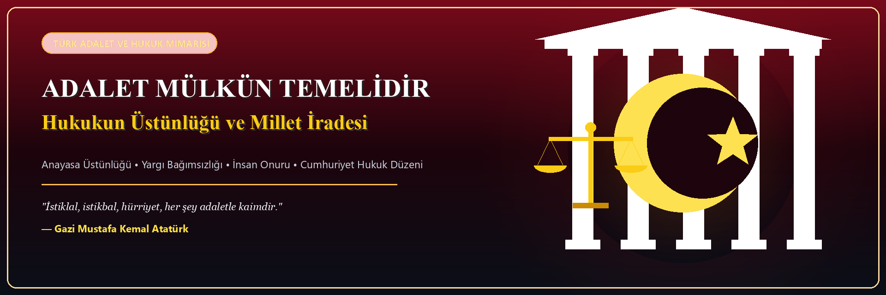
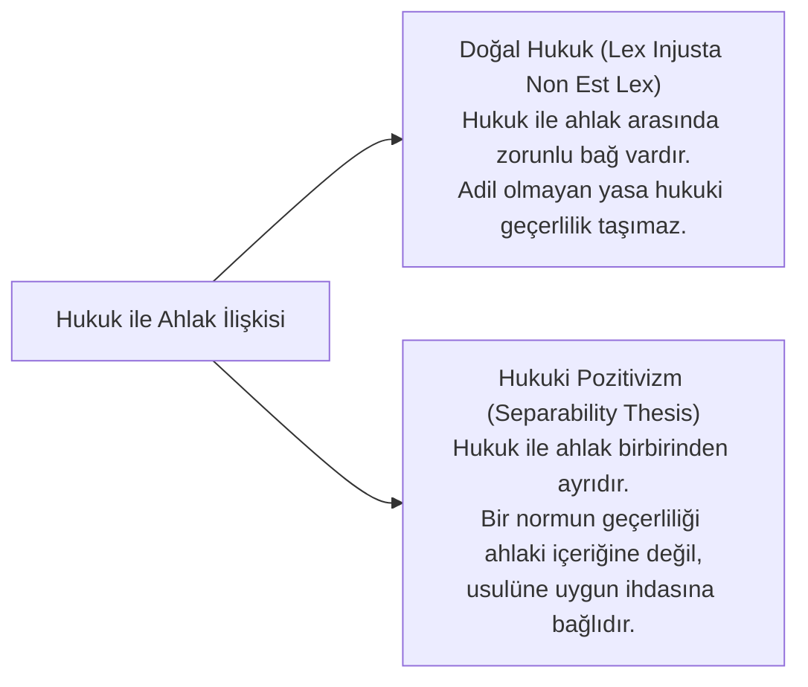
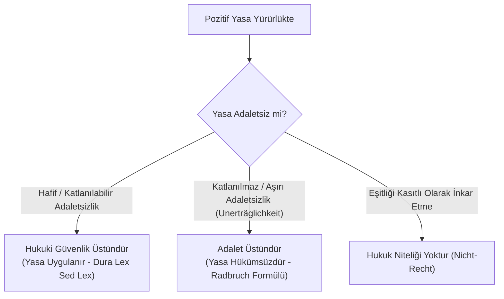
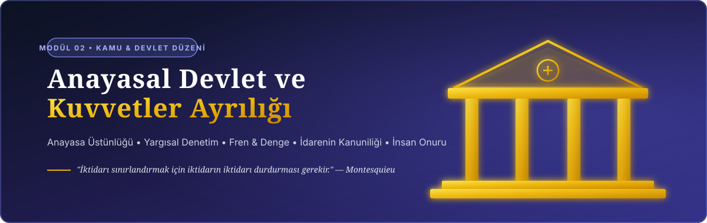
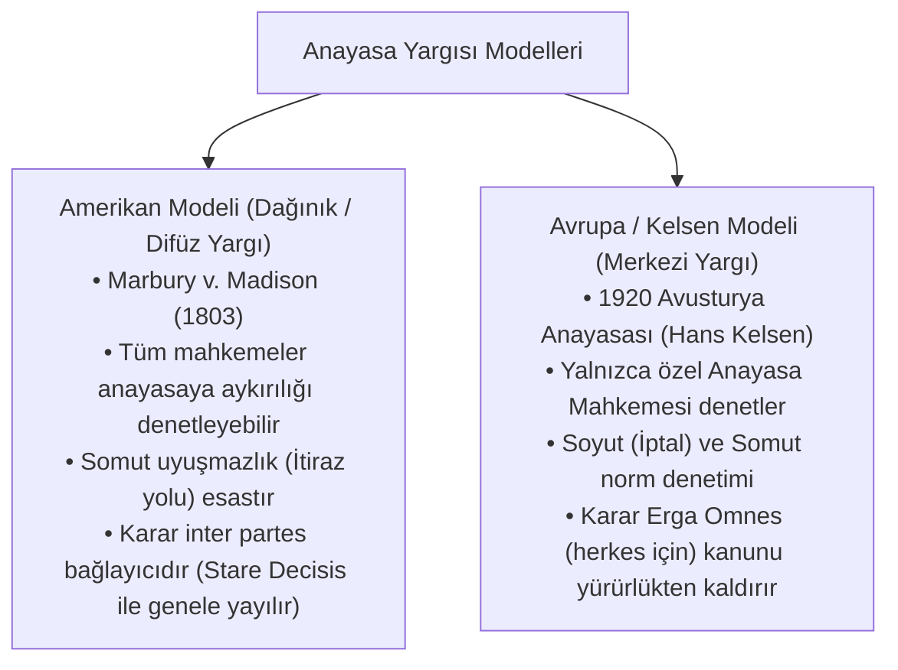
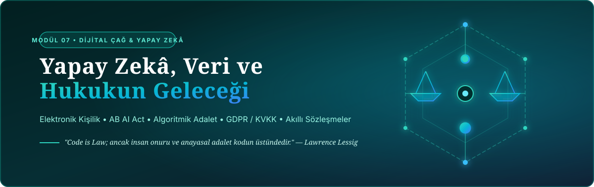
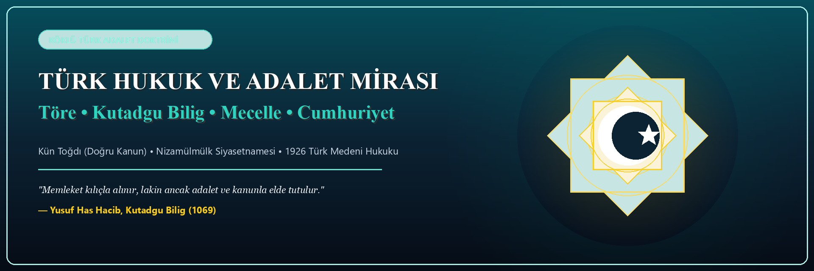

# Hukuk Kuramı, Adalet Felsefesi ve Yasal Düzen Kütüphanesi

<div align="center">

[](https://opensource.org/licenses/MIT)
[](#-k%C3%BCt%C3%BCphane-ve-dizin-haritas%C4%B1)
[](#-tematik-mod%C3%BCller-ve-do%C4%9Frudan-ba%C4%9Flant%C4%B1lar)
[](04-kaynakca-ve-okuma-listesi/kavramlar-ve-latince-hukuk-terimleri-sozlugu.md)
[]()

<br/>

<p align="center">
  
</p>

**Hukuk Felsefesi • Pozitif Hukuk Kuramı • Anayasal Devlet Düzeni • Karşılaştırmalı Hukuk • Hukuk Sosyolojisi • Yapay Zekâ & Dijital Adalet**

</div>

---

## 🏛️ Hukuk ve Adalet Üzerine Başlangıç Epigrafları

> *"Adalet mülkün temelidir; hukukun bittiği yerde tiranlık başlar."*  
> — **John Locke**, *Hükümet Üzerine İkinci İnceleme (Second Treatise of Government, 1689)*

> *"Hukuk, aklın tutkulardan ve ihtiraslardan arınmış sesidir."*  
> — **Aristoteles**, *Politika (M.Ö. 4. Yüzyıl)*

> *"Iustitia est constans et perpetua voluntas ius suum cuique tribuendi."*  
> *(Adalet, herkese hakkı olanı verme konusundaki değişmez ve sürekli iradedir.)*  
> — **Domitius Ulpianus**, *Digesta (1.1.10)*

> *"Devletin nihai amacı tahakküm kurmak değil, insanları korkudan arındırarak özgür kılmaktır; adalet ise bu özgürlüğün koruyucu kalkanıdır."*  
> — **Baruch Spinoza**, *Tractatus Theologico-Politicus (1670)*

> *"Yasa koyucu, adaleti bir yana bıraktığında; devlet, büyük bir haydut çetesinden başka nedir?"*  
> — **Aziz Augustinus**, *De Civitate Dei (Tanrı Devleti, IV. Kitap)*

> *"Bir tek kişiye yapılan haksızlık, bütün topluma yöneltilmiş bir tehdittir."*  
> — **Montesquieu**, *Kanunların Ruhu Üzerine (De l'esprit des lois, 1748)*

> *"Adaletsiz bir yasa, yasa olmaktan çok bir şiddet eylemidir."*  
> — **Aquino'lu Thomas**, *Summa Theologiae (I-II, q. 96, a. 4)*

> *"Hukukun en temel görevi, gücün keyfiyetini kırmak ve zayıfı güçlünün tahakkümünden korumaktır."*  
> — **Gustav Radbruch**, *Rechtsphilosophie (1932)*

---

## 🧭 1. Giriş ve Epistemolojik Çerçeve: *Quid Ius?*

Immanuel Kant, *Saf Aklın Eleştirisi* ve *Ahlak Metafiziği: Hukuk Öğretisi (Rechtslehre)* eserlerinde hukukçuların karşılaştığı en temel açmazı şu meşhur soruyla özetler:

$$\text{"Noch suchen die Juristen eine Definition zu ihrem Begriffe von Recht."}$$
*(Hukukçular hâlâ kendi hukuk kavramlarının tanımını aramaktadırlar.)*

Kant'a göre bir hukukçunun yanıtlaması gereken iki ayrı soru düzlemi vardır:
1. **Quid Iuris? (Yürürlükteki Hukuk Nedir?):** Belirli bir zamanda ve mekânda pozitif kanunların neyi emrettiği, neyi yasakladığı veya izin verdiği meselesidir (Pozitif Hukukun Alanı).
2. **Quid Ius? (Hukukun Özü ve Hakkaniyet Nedir?):** Bir normun veya eylemin evrensel ahlaki ve rasyonel standartlar açısından **adil ve meşru** olup olmadığı meselesidir (Hukuk Felsefesinin Alanı).

Bu kütüphane; hukuku yalnızca salt maddelerden ve kanun metinlerinden ibaret görmeyip, onu felsefi temelleri, kurumsal mimarisi, toplumsal işlevleri ve teknolojik dönüşümüyle bir bütün olarak ele almaktadır.

```mermaid
flowchart TD
    subgraph Hukukun Üç Boyutlu Doğası (Dreidimensionale Rechtstheorie)
        A["1. Normatif Boyut (Geçerlilik / Sollen)"] <--> B["2. Olgusal / Sosyolojik Boyut (Etkililik / Sein)"]
        B <--> C["3. Aksiyolojik / Felsefi Boyut (Adalet / Değer)"]
        C <--> A
    end
```

---

## 🔍 2. Kapsamlı Doktrin ve Teori İncelemeleri

### A. Doğal Hukuk vs Hukuki Pozitivizm Antagonizması

Hukuk felsefesi tarihinin en derin tartışması; "Hukuk ile Ahlak arasında zorunlu bir bağ var mıdır?" sorusu etrafında şekillenmiştir:



#### Karşılaştırmalı Matris:
| Parametre | Doğal Hukuk Geleneği (*Natural Law*) | Hukuki Pozitivizm (*Legal Positivism*) |
| :--- | :--- | :--- |
| **Geçerlilik Kriteri** | Evrensel adalet, insan doğası ve rasyonel ahlak normlarına uygunluk. | Yetkili organ tarafından usulüne uygun konulmuş olma (*Promulgation*). |
| **Hukuk-Ahlak Bağı** | **Zorunlu Bağlantı Tezi:** Ahlaka aykırı olan kural hukuk olamaz (*Augustinus, Aquinas, Fuller*). | **Ayrılabilirlik Tezi (*Separability*):** Hukukun mevcudiyeti ayrı, ahlaki liyakati ayrıdır (*Austin, Hart, Kelsen*). |
| **Yargıcın Rolü** | Pozitif norm adaletsizse hakkaniyete ve doğal hukuka başvurmalıdır. | Yargıç kişisel ahlaki inançlarını değil, konulmuş pozitif normu uygular. |
| **Tarihsel Kriz Noktası** | Rasyonel Aydınlanma ve II. Dünya Savaşı sonrası Nürnberg Mahkemeleri. | 19. yüzyıl Sanayi Devrimi ve modern ulus-devlet kodifikasyonları. |

---

### B. Radbruch Formülü ve Hukukun Sınırı

Gustav Radbruch, Nazi Almanyası deneyiminin ardından 1946 yılında kaleme aldığı *"Yasal Haksızlık ve Yasa Üstü Hukuk"* (*Gesetzliches Unrecht und übergesetzliches Recht*) makalesinde hukuki pozitivizmin çıkmazını şu formülle çözmüştür:

> *"Pozitif hukuk, içeriği bakımından adaletsiz ve amaca aykırı olsa bile, kanun olarak yürürlükte kaldığı sürece öncelikle uygulanmalıdır. Ancak pozitif yasa ile adalet arasındaki çelişki öyle **katlanılmaz bir düzeye (*unerträgliches Maß*)** ulaşırsa ki yasa 'adaletsiz hukuk' niteliğini aşarak **'yasal haksızlık' (*gesetzliches Unrecht*)** haline gelirse, o yasa adalet karşısında geri çekilmek zorundadır ve hukuk niteliğini kaybeder."*



---

### C. John Rawls: Hakkaniyet Olarak Adalet (*Justice as Fairness*)

John Rawls, 1971 tarihli başyapıtı *A Theory of Justice* ile faydacılığın (*utilitarianism*) "çoğunluğun mutluluğu için azınlığın haklarını feda etme" mantığını çürütmüş ve çağdaş liberal adalet teorisini inşa etmiştir:

1. **Bilinmezlik Peçesi (*Veil of Ignorance*):** Bireyler toplumdaki sınıflarını, ırklarını, cinsiyetlerini, zekâlarını ve servetlerini bilmedikleri varsayımsal bir **Başlangıç Durumunda (*Original Position*)** adalet ilkelerini seçerler.
2. **Birinci İlke (Eşit Temel Özgürlükler İlkesi):** Herkes en geniş temel özgürlükler sistemine eşit şekilde sahip olmalıdır.
3. **İkinci İlke (Sosyo-Ekonomik Eşitlikler):**
   * **Fırsat Eşitliği:** Konumlar ve makamlar herkese adil fırsat eşitliğiyle açık olmalıdır.
   * **Fark İlkesi (*Difference Principle*):** Toplumdaki ekonomik eşitsizlikler, ancak **toplumun en dezavantajlı kesiminin en yüksek yararına (*maximin*)** olacak şekilde düzenlendiğinde meşrudur.

---

### D. Ronald Dworkin: Kurallar, İlkeler ve "Hakları Ciddiye Almak"

H.L.A. Hart'ın pozitivizmine karşı çıkan Ronald Dworkin, hukukun yalnızca açık "kurallardan" (*rules*) oluşmadığını, kuralların arkasında yatan **"ilkeler" (*principles*)** ve anayasal değerlerin de hukukun kurucu parçası olduğunu kanıtlamıştır:

* **Kural vs İlke:** Kurallar "ya hep ya hiç" (*all-or-nothing*) tarzında uygulanır (Örn: Hız sınırı 90 km/s). İlkeler ise birer "ağırlık ve değer" (*dimension of weight*) taşır ve çatıştıklarında dengelenir (*Balancing* - Örn: *"Hiç kimse kendi kusurundan menfaat sağlayamaz"*).
* **Riggs v. Palmer Vakası (1889):** Mirasa konmak için dedesini öldüren torunun mirası alıp alamayacağı davasında New York Mahkemesi, kanunda açık hüküm bulunmamasına rağmen *"kimse kendi haksız fiilinden menfaat sağlayamaz"* evrensel hukuk ilkesine dayanarak mirastan mahrum bırakmıştır.

---

<p align="center">
  
</p>

### E. Anayasa Yargısı ve Hukuk Devleti: İki Büyük Model



---

## 📖 3. Büyük Düşünürlerden Hukuk ve Adalet Vecizeleri Antolojisi

### Antikçağ ve Roma Hukukçuları
* > *"Gerçek yasa; doğayla uyumlu, evrensel, kalıcı, bizi görevlerimizi yerine getirmeye çağıran ve kötülükten alıkoyan doğru akıldır. Bu yasayı değiştirmek günah, yürürlükten kaldırmaya kalkışmak imkânsızdır; ne senato ne de halk bizi bu yasanın bağlayıcılığından muaf tutabilir."*  
  > — **Marcus Tullius Cicero**, *De Re Publica (Devlet Üzerine, III. Kitap)*
* > *"Hukukun emirleri şunlardır: Onurlu yaşamak, kimseye zarar vermemek, herkese hakkı olanı vermek."*  
  > *(Iuris praecepta sunt haec: honeste vivere, alterum non laedere, suum cuique tribuere.)*  
  > — **Ulpianus**, *Institutiones (Digesta 1.1.10.1)*
* > *"Hukukun hükümdarı akıl, aklın nihai amacı ise adalettir."*  
  > — **Platon**, *Nomoi (Yasalar)*

---

### Orta Çağ, Skolastik ve Rasyonel Doğal Hukuk
* > *"Adalet olmadan krallıklar, organize birer haydutluk teşkilatından farksızdır."*  
  > — **Aziz Augustinus**, *De Civitate Dei*
* > *"Tanrı olmasaydı bile -ki bunu söylemek büyük bir küfürdür- doğal hukuk aklın gereği olarak yine de geçerliliğini ve bağlayıcılığını korurdu."*  
  > *(Etiamsi daremus non esse Deum.)*  
  > — **Hugo Grotius**, *De Jure Belli ac Pacis (Savaş ve Barış Hukuku, 1625)*
* > *"Kanunların amacı özgürlüğü yok etmek veya kısıtlamak değil; tam tersine onu korumak ve genişletmektir. Çünkü kanunun olmadığı yerde özgürlük de olamaz."*  
  > — **John Locke**, *Second Treatise of Government (§ 57)*

---

### Aydınlanma, Anayasacılık ve Ceza Reformu
* > *"Bir insanın keyfi olarak hapsedilmesinin engellenmesi, vatandaşların can güvenliğini ve anayasal özgürlüğü teminat altına alan en yüce kaledir."*  
  > — **William Blackstone**, *Commentaries on the Laws of England (1765)*
* > *"İnsanların cezalandırılmasındaki meşruiyet sınırı, yalnızca toplumun güvenliğini koruma zorunluluğudur. Bu zorunluluğu aşan her ceza tiranlıktır."*  
  > — **Cesare Beccaria**, *Suçlar ve Cezalar Hakkında (Dei delitti e delle pene, 1764)*
* > *"Eğer adalet ortadan kalkarsa, insanların yeryüzünde yaşamasının hiçbir anlamı ve değeri kalmaz."*  
  > — **Immanuel Kant**, *Die Metaphysik der Sitten (1797)*

---

### 19. ve 20. Yüzyıl Hukuk Teorisi ve Pozitivizm
* > *"Hukukun varlığı bir şeydir; onun ahlaki liyakati veya kusuru ise bambaşka bir şeydir."*  
  > — **John Austin**, *The Province of Jurisprudence Determined (1832)*
* > *"Hukuk düzeni, rastgele yan yana duran kurallardan değil, meşruiyetini birbiri ardına sıralanan üst normlardan ve nihayetinde temel normdan (Grundnorm) alan hiyerarşik bir basamaklar piramididir."*  
  > — **Hans Kelsen**, *Saf Hukuk Kuramı (Reine Rechtslehre, 1934)*
* > *"Hukuk kuralları kelimelerin doğası gereği açık bir dokuya (open texture) sahiptir. Bu açık doku, hukukun değişen hayat olaylarına nefes alabilmesini sağlar."*  
  > — **H.L.A. Hart**, *The Concept of Law (1961)*
* > *"Bireysel anayasal haklar, çoğunluğun menfaati veya faydacı hesapları karşısında bireye verilmiş en güçlü kozdur (Rights as Trumps)."*  
  > — **Ronald Dworkin**, *Taking Rights Seriously (1977)*

---

### Eleştirel Teori, Sosyoloji ve Feminizm
* > *"Hukukun gelişimi mantıkla değil, bizzat hayatın tecrübesiyle şekillenir."*  
  > — **Oliver Wendell Holmes Jr.**, *The Common Law (1881)*
* > *"Devletin çıkardığı kanunlar toplumsal bilince ve yaşayan hukuka dayanmıyorsa, yalnızca kütüphane raflarını dolduran kâğıt yığınlarıdır."*  
  > — **Eugen Ehrlich**, *Hukuk Sosyolojisinin Temelleri (1913)*
* > *"Erkek egemen hukuk, kendi taraflı bakış açısını 'evrensel ve objektif gerçeklik' olarak sunmakta ustadır; feminist mücadelenin görevi bu sahte tarafsızlık maskesini düşürmektir."*  
  > — **Catharine A. MacKinnon**, *Toward a Feminist Theory of the State (1989)*

---

<p align="center">
  
</p>

### Dijital Çağ, Yapay Zekâ ve Geleceğin Hukuku
* > *"Siber uzayda ve dijital evrende kod yasadır (Code is Law); ancak kodun meşruiyetini denetleyecek olan yine anayasal hukuk ve insan onurudur."*  
  > — **Lawrence Lessig**, *Code and Other Laws of Cyberspace (1999)*
* > *"Adalet bir algoritmanın istatistiksel optimizasyonuna indirgenemez; vicdan, hakkaniyet ve insan haysiyeti silikona devredilemez."*  
  > — **Shoshana Zuboff**, *The Age of Surveillance Capitalism (2019)*

---

## 📚 4. Kütüphane ve Dizin Haritası

```text
hukuk-kurami-ve-adalet/
├── index.html                                          # İnteraktif Web Portalı ve Canlı Arama Motoru
├── 01-felsefe-ve-kuram/                                # MODÜL 01: Hukuk Felsefesi ve Kuramı
│   ├── README.md                                       # Modül Özeti ve Dizin Haritası
│   ├── dogal-hukuk-gelenegi/
│   │   ├── README.md
│   │   ├── antik-donem-ve-stoa.md                      # Logos, Platon, Aristoteles, Cicero
│   │   ├── orta-cag-ve-skolastik.md                    # Augustinus, Aquinas ve Dörtlü Norm Düzeni
│   │   ├── rasyonel-dogal-hukuk.md                     # Grotius, Hobbes, Locke, Rousseau
│   │   └── radbruch-formulu-ve-modern-donus.md         # Yasal Haksızlık & Yasa Üstü Hukuk
│   ├── pozitivizm-ve-normativizm/
│   │   ├── README.md
│   │   ├── erken-pozitivizm-ve-buyruk-teorisi.md       # Bentham & John Austin Yaptırım Modeli
│   │   ├── saf-hukuk-kurami-kelsen.md                  # Grundnorm & Hiyerarşik Normativizm
│   │   ├── hart-hukuk-kavrami.md                       # Rule of Recognition & Open Texture
│   │   └── hukuki-realizm-ve-elestirel-hukuk.md        # Holmes, Ross, Amerikan Realizmi
│   └── adalet-teorileri/
│       ├── README.md
│       ├── dagitici-ve-duzeltici-adalet.md             # Aristoteles Adalet Tasnifleri
│       ├── faydacilik-ve-adalet.md                     # Bentham & J.S. Mill Fayda İlkesi
│       ├── rawls-hakkaniyet-olarak-adalet.md           # Original Position & Fark İlkesi
│       ├── nozick-ve-liberteryen-adalet.md             # Yetkilenme Kuramı & Minimal Devlet
│       ├── habermas-ve-muzakereci-demokrasi.md         # İletişimsel Eylem & Kamusal Müzakere
│       └── sandeller-ve-komuniter-elestiri.md          # Atomistik Birey Eleştirisi & Ortak İyi
├── 02-kamu-ve-devlet-duzeni/                           # MODÜL 02: Kamu ve Anayasal Devlet Düzeni
│   ├── README.md
│   ├── anayasal-devlet-ve-egemenlik/
│   │   ├── README.md
│   │   ├── egemenlik-kavraminin-evrimi.md              # Bodin, Hobbes, Rousseau, Modern Egemenlik
│   │   ├── anayasa-ustunlugu-ve-yargisal-denetim.md    # Marbury v. Madison & AYM Denetim Modelleri
│   │   └── temel-haklar-ve-insan-onuru.md              # İnsan Onuru & Hakkın Özü Güvencesi
│   ├── kuvvetler-ayriligi/
│   │   ├── README.md
│   │   ├── montesquieu-ve-fren-denge-sistemi.md        # Checks and Balances & Erkler Ayrılığı
│   │   ├── hukumet-sistemleri-ve-erkler-iliskisi.md    # Parlamenter, Başkanlık, Yarı-Başkanlık
│   │   └── yargi-bagimsizligi-ve-tarafsizligi.md       # Hâkimlik Teminatı & Doğal Hâkim İlkesi
│   └── idarenin-hukukiligi/
│       ├── README.md
│       ├── kanuni-idare-ve-bagli-yetki-takdir-yetkisi.md # Kanuni İdare & Takdir Yetkisi Sınırları
│       ├── hukuki-guvenlik-ve-kazanilmis-haklar.md     # Belirlilik, İstikrar & Haklı Beklentiler
│       └── idari-islemlerin-iptal-sebepleri.md         # Yetki, Şekil, Sebep, Konu, Maksat
├── 03-kavramlar-ve-doktrinler/                         # MODÜL 03: Temel Doktrinler, Usul & Mantık
│   ├── README.md
│   ├── normlar-hiyerarsisi.md                          # Stufenbaulehre & Antinomi Kuralları
│   ├── hukuki-yorumsal-yontemler.md                    # Hermeneutik, Lafzi, Teleolojik, A Fortiori
│   ├── hukuk-boslugu-ve-hakimin-hukuk-yaratmasi.md     # TMK m. 1/2 & Teleolojik İndirgeme
│   ├── hak-kavrami-ve-turleri.md                       # Hohfeld Hak Matrisi & İnşai Haklar
│   ├── hukukta-nedensellik-ve-sorumluluk.md            # Uygun İlliyet & Kusursuz Sorumluluk
│   ├── olcululuk-ve-belirlilik.md                      # Elverişlilik, Gereklilik, Orantılılık
│   ├── tabii-hakim-ilkesi.md                           # Kanuni Hâkim Güvencesi
│   ├── masumiyet-karinesi-ve-lehe-kanun.md             # Presumption of Innocence & Lex Mitior
│   ├── ceza-hukukunun-evrensel-ilkeleri.md             # Nullum Crimen, In Dubio Pro Reo, Ne Bis In Idem
│   └── hakkin-kotuye-kullanilmasi-ve-durustluk-kurali.md # TMK m. 2 & Venire Contra Factum Proprium
├── 04-kaynakca-ve-okuma-listesi/                       # MODÜL 04: Literatür, İçtihat & Sözlük
│   ├── README.md
│   ├── klasik-metinler.md                              # Antikçağ & Aydınlanma Temel Metinleri
│   ├── modern-literatur.md                             # Çağdaş Hukuk Monografileri & Makaleler
│   ├── ictihat-ve-emsal-kararlar.md                    # AİHM, BVerfG, ABD Supreme Court, AYM
│   └── kavramlar-ve-latince-hukuk-terimleri-sozlugu.md # Brocardica Juridica (50+ Latince Kural)
├── 05-karsilastirmali-hukuk-ve-sistemler/              # MODÜL 05: Karşılaştırmalı Hukuk Düzenleri
│   ├── README.md
│   ├── kita-avrupasi-ve-ortak-hukuk-karsilastirmasi.md # Civil Law vs Common Law & Stare Decisis
│   ├── dini-ve-geleneksel-hukuk-sistemleri.md          # Fıkıh, Halaha, Doğu Asya & Ubuntu
│   ├── uluslarustu-ve-kuresel-hukuk-duzenleri.md       # AB Hukuku, Jus Cogens, Lex Mercatoria
│   └── gecis-donemi-adaleti-ve-yuzlesme.md             # Hakikat Komisyonları & Lustration
├── 06-hukuk-sosyolojisi-ve-elestirel-yaklasimlar/      # MODÜL 06: Sosyoloji & Eleştirel Teori
│   ├── README.md
│   ├── hukuk-sosyolojisinin-temelleri.md               # Ehrlich Yaşayan Hukuk, Weber, Durkheim
│   ├── elestirel-hukuk-calismalari-ve-postmodernizm.md # CLS Hareketi, Indeterminacy, Foucault
│   ├── feminist-hukuk-teorisi-ve-toplumsal-cinsiyet.md # MacKinnon, Bakım Etiği, Kesişimsellik
│   └── hukuk-ve-iktisat-ekolu.md                       # Coase Teoremi, Posner, Kaldor-Hicks
└── 07-dijital-cag-yapay-zeka-ve-hukukun-gelecegi/      # MODÜL 07: Yapay Zekâ & Dijital Hukuk
    ├── README.md
    ├── yapay-zeka-ve-hukuki-kisilik-sorunu.md          # E-Personhood, AI Act Risk Piramidi
    ├── algoritmik-adalet-ve-yargisal-otomasyon.md      # COMPAS Vakası, CEPEJ Şartı, Tahminleyici Yargı
    ├── dijital-haklar-veri-egemenligi-ve-mahremiyet.md # GDPR, KVKK, Unutulma Hakkı, Nörohukuk
    └── akilli-sozlesmeler-ve-merkeziyetsiz-hukuk.md    # Code is Law, DAO Hukuku, Blokzincir Tahkimi
```

---

## 🧭 5. Tematik Modüllere Hızlı Erişim

### [01. Felsefe ve Kuram](01-felsefe-ve-kuram/README.md)
* **Doğal Hukuk:** [Antikçağ & Stoa](01-felsefe-ve-kuram/dogal-hukuk-gelenegi/antik-donem-ve-stoa.md) | [Skolastik Hukuk](01-felsefe-ve-kuram/dogal-hukuk-gelenegi/orta-cag-ve-skolastik.md) | [Rasyonel Doğal Hukuk](01-felsefe-ve-kuram/dogal-hukuk-gelenegi/rasyonel-dogal-hukuk.md) | [Radbruch Formülü](01-felsefe-ve-kuram/dogal-hukuk-gelenegi/radbruch-formulu-ve-modern-donus.md)
* **Pozitivizm & Normativizm:** [Bentham & Austin Buyruk Teorisi](01-felsefe-ve-kuram/pozitivizm-ve-normativizm/erken-pozitivizm-ve-buyruk-teorisi.md) | [Kelsen Saf Hukuk Kuramı](01-felsefe-ve-kuram/pozitivizm-ve-normativizm/saf-hukuk-kurami-kelsen.md) | [H.L.A. Hart Hukuk Kavramı](01-felsefe-ve-kuram/pozitivizm-ve-normativizm/hart-hukuk-kavrami.md) | [Hukuki Realizm & CLS](01-felsefe-ve-kuram/pozitivizm-ve-normativizm/hukuki-realizm-ve-elestirel-hukuk.md)
* **Adalet Kuramları:** [Dağıtıcı & Düzeltici Adalet](01-felsefe-ve-kuram/adalet-teorileri/dagitici-ve-duzeltici-adalet.md) | [Faydacılık](01-felsefe-ve-kuram/adalet-teorileri/faydacilik-ve-adalet.md) | [Rawls: Hakkaniyet Olarak Adalet](01-felsefe-ve-kuram/adalet-teorileri/rawls-hakkaniyet-olarak-adalet.md) | [Nozick: Yetkilenme Kuramı](01-felsefe-ve-kuram/adalet-teorileri/nozick-ve-liberteryen-adalet.md) | [Habermas: Müzakereci Demokrasi](01-felsefe-ve-kuram/adalet-teorileri/habermas-ve-muzakereci-demokrasi.md) | [Komüniter Eleştiri](01-felsefe-ve-kuram/adalet-teorileri/sandeller-ve-komuniter-elestiri.md)

### [02. Kamu ve Devlet Düzeni](02-kamu-ve-devlet-duzeni/README.md)
* **Anayasal Devlet:** [Egemenliğin Evrimi](02-kamu-ve-devlet-duzeni/anayasal-devlet-ve-egemenlik/egemenlik-kavraminin-evrimi.md) | [Anayasa Yargısı & Denetim Modelleri](02-kamu-ve-devlet-duzeni/anayasal-devlet-ve-egemenlik/anayasa-ustunlugu-ve-yargisal-denetim.md) | [İnsan Onuru & Temel Haklar](02-kamu-ve-devlet-duzeni/anayasal-devlet-ve-egemenlik/temel-haklar-ve-insan-onuru.md)
* **Kuvvetler Ayrılığı:** [Montesquieu & Fren-Denge](02-kamu-ve-devlet-duzeni/kuvvetler-ayriligi/montesquieu-ve-fren-denge-sistemi.md) | [Hükümet Sistemleri](02-kamu-ve-devlet-duzeni/kuvvetler-ayriligi/hukumet-sistemleri-ve-erkler-iliskisi.md) | [Yargı Bağımsızlığı & Güvencesi](02-kamu-ve-devlet-duzeni/kuvvetler-ayriligi/yargi-bagimsizligi-ve-tarafsizligi.md)
* **İdarenin Hukukiliği:** [Bağlı Yetki & Takdir Yetkisi](02-kamu-ve-devlet-duzeni/idarenin-hukukiligi/kanuni-idare-ve-bagli-yetki-takdir-yetkisi.md) | [Hukuki Güvenlik & Kazanılmış Haklar](02-kamu-ve-devlet-duzeni/idarenin-hukukiligi/hukuki-guvenlik-ve-kazanilmis-haklar.md) | [İdari İşlemlerin İptal Sebepleri](02-kamu-ve-devlet-duzeni/idarenin-hukukiligi/idari-islemlerin-iptal-sebepleri.md)

### [03. Temel Kavramlar ve Doktrinler](03-kavramlar-ve-doktrinler/README.md)
* [Normlar Hiyerarşisi (Stufenbaulehre)](03-kavramlar-ve-doktrinler/normlar-hiyerarsisi.md)
* [Hukuki Yorum Yöntemleri ve Mantıksal Çıkarımlar (Hermeneutik)](03-kavramlar-ve-doktrinler/hukuki-yorumsal-yontemler.md)
* [Hukuk Boşluğu ve Hâkimin Hukuk Yaratması](03-kavramlar-ve-doktrinler/hukuk-boslugu-ve-hakimin-hukuk-yaratmasi.md)
* [Hak Kavramı ve Hohfeldian Haklar Analizi](03-kavramlar-ve-doktrinler/hak-kavrami-ve-turleri.md)
* [Hukukta Nedensellik ve Sorumluluk Kuramları](03-kavramlar-ve-doktrinler/hukukta-nedensellik-ve-sorumluluk.md)
* [Ölçülülük ve Hukuki Belirlilik Doktrini](03-kavramlar-ve-doktrinler/olcululuk-ve-belirlilik.md)
* [Tabii Hâkim (Kanuni Hâkim) İlkesi](03-kavramlar-ve-doktrinler/tabii-hakim-ilkesi.md)
* [Masumiyet Karinesi ve Lehe Kanunun Geriye Yürümesi](03-kavramlar-ve-doktrinler/masumiyet-karinesi-ve-lehe-kanun.md)
* [Ceza Hukukunun Evrensel İlkeleri](03-kavramlar-ve-doktrinler/ceza-hukukunun-evrensel-ilkeleri.md)
* [Dürüstlük Kuralı ve Hakkın Kötüye Kullanılması Yasağı](03-kavramlar-ve-doktrinler/hakkin-kotuye-kullanilmasi-ve-durustluk-kurali.md)

### [04. Kaynakça, Literatür ve Sözlük](04-kaynakca-ve-okuma-listesi/README.md)
* [Klasik Metinler ve Çeviriler](04-kaynakca-ve-okuma-listesi/klasik-metinler.md)
* [Modern Literatür ve Makaleler](04-kaynakca-ve-okuma-listesi/modern-literatur.md)
* [Emsal Yüksek Mahkeme Kararları (AİHM, BVerfG, AYM, Danıştay)](04-kaynakca-ve-okuma-listesi/ictihat-ve-emsal-kararlar.md)
* [Latince Hukuk Özdeyişleri ve Terimler Sözlüğü (Brocardica Juridica)](04-kaynakca-ve-okuma-listesi/kavramlar-ve-latince-hukuk-terimleri-sozlugu.md)

---

<p align="center">
  
</p>

### [05. Karşılaştırmalı Hukuk ve Sistemler](05-karsilastirmali-hukuk-ve-sistemler/README.md)
* [Kıta Avrupası (*Civil Law*) ve Ortak Hukuk (*Common Law*) Karşılaştırması](05-karsilastirmali-hukuk-ve-sistemler/kita-avrupasi-ve-ortak-hukuk-karsilastirmasi.md)
* [Dini ve Geleneksel Hukuk Sistemleri (Fıkıh, Halaha, Doğu Asya, Ubuntu)](05-karsilastirmali-hukuk-ve-sistemler/dini-ve-geleneksel-hukuk-sistemleri.md)
* [Uluslarüstü ve Küresel Hukuk Düzenleri (AB Hukuku, Jus Cogens, Lex Mercatoria)](05-karsilastirmali-hukuk-ve-sistemler/uluslarustu-ve-kuresel-hukuk-duzenleri.md)
* [Geçiş Dönemi Adaleti ve Tarihsel Yüzleşme (Hakikat Komisyonları & Arınma)](05-karsilastirmali-hukuk-ve-sistemler/gecis-donemi-adaleti-ve-yuzlesme.md)

### [06. Hukuk Sosyolojisi ve Eleştirel Yaklaşımlar](06-hukuk-sosyolojisi-ve-elestirel-yaklasimlar/README.md)
* [Hukuk Sosyolojisinin Temelleri: Yaşayan Hukuk (Ehrlich, Weber, Durkheim, Pound)](06-hukuk-sosyolojisi-ve-elestirel-yaklasimlar/hukuk-sosyolojisinin-temelleri.md)
* [Eleştirel Hukuk Çalışmaları (*CLS*) ve Postmodernizm (Kennedy, Unger, Foucault)](06-hukuk-sosyolojisi-ve-elestirel-yaklasimlar/elestirel-hukuk-calismalari-ve-postmodernizm.md)
* [Feminist Hukuk Teorisi ve Toplumsal Cinsiyet Adaleti (MacKinnon, Crenshaw)](06-hukuk-sosyolojisi-ve-elestirel-yaklasimlar/feminist-hukuk-teorisi-ve-toplumsal-cinsiyet.md)
* [Hukuk ve İktisat Ekolü (*Law and Economics* - Coase, Posner, Calabresi)](06-hukuk-sosyolojisi-ve-elestirel-yaklasimlar/hukuk-ve-iktisat-ekolu.md)

### [07. Dijital Çağ, Yapay Zekâ ve Hukukun Geleceği](07-dijital-cag-yapay-zeka-ve-hukukun-gelecegi/README.md)
* [Yapay Zekâ, Otonom Sistemler ve Hukuki Kişilik Sorunu (AB AI Act)](07-dijital-cag-yapay-zeka-ve-hukukun-gelecegi/yapay-zeka-ve-hukuki-kisilik-sorunu.md)
* [Algoritmik Adalet, Yargısal Otomasyon ve Tahminleyici Yargı (COMPAS & CEPEJ)](07-dijital-cag-yapay-zeka-ve-hukukun-gelecegi/algoritmik-adalet-ve-yargisal-otomasyon.md)
* [Dijital Haklar, Veri Egemenliği ve Mahremiyet (GDPR, KVKK, Unutulma Hakkı)](07-dijital-cag-yapay-zeka-ve-hukukun-gelecegi/dijital-haklar-veri-egemenligi-ve-mahremiyet.md)
* [Akıllı Sözleşmeler, Blokzincir ve Merkeziyetsiz Hukuk (Code is Law & DAO)](07-dijital-cag-yapay-zeka-ve-hukukun-gelecegi/akilli-sozlesmeler-ve-merkeziyetsiz-hukuk.md)

---

## ⚖️ 6. Metodoloji ve Akademik Standartlar

1. **Kavramsal ve Doktriner Derinlik:** Hukuki kavramlar hem tarihsel-felsefi kökenleri hem de pozitif hukuk uygulamasındaki sonuçları itibarıyla açıklanır.
2. **Karşılaştırmalı Perspektif:** Kıta Avrupası Hukuku (*Civil Law*) ve Ortak Hukuk (*Common Law*) geleneklerinin adalet, yargılama ve hukuk devleti kavrayışları mukayese edilir.
3. **Doktrin - İçtihat Bütünlüğü:** Soyut felsefi ilkeler, Anayasa Mahkemesi ve AİHM gibi yüksek yargı organlarının somut norm denetimi ve bireysel başvuru kararlarıyla desteklenir.
4. **Geleceğin Hukuku ve Dijital Adalet:** Yapay zekâ, veri mahremiyeti ve blokzincir gibi yeni nesil meydan okumalar evrensel insan onuru standardıyla ele alınır.
5. **Açık ve Evrensel Bilgi:** Hukukun üstünlüğü, kuvvetler ayrılığı, insan onuru ve keyfiyetin önlenmesi gayesine hizmet eden açık kaynak akademik bilgi mimarisi sunulur.

---

## 📜 7. Temel Okuma Listesi ve Bibliyografya

* **Platon** — *Devlet (Politeia)* & *Yasalar (Nomoi)*
* **Aristoteles** — *Nikomakhos'a Etik (Ethica Nicomachea)* & *Politika (Politica)*
* **Marcus Tullius Cicero** — *Devlet Üzerine (De Re Publica)* & *Yasalar Üzerine (De Legibus)*
* **Thomas Aquinas** — *Summa Theologiae (Tractatus de Legibus & Tractatus de Justitia)*
* **Thomas Hobbes** — *Leviathan, or The Matter, Forme and Power of a Commonwealth (1651)*
* **John Locke** — *Second Treatise of Government: An Essay Concerning the True Original, Extent, and End of Civil Government (1689)*
* **Baruch Spinoza** — *Tractatus Theologico-Politicus (1670)* & *Tractatus Politicus (1677)*
* **Charles de Montesquieu** — *De l'esprit des lois (Kanunların Ruhu Üzerine, 1748)*
* **Jean-Jacques Rousseau** — *Du contrat social; ou, Principes du droit politique (1762)*
* **Immanuel Kant** — *Die Metaphysik der Sitten: Rechtslehre (1797)*
* **Georg Wilhelm Friedrich Hegel** — *Grundlinien der Philosophie des Rechts (Hukuk Felsefesinin Prensipleri, 1821)*
* **John Austin** — *The Province of Jurisprudence Determined (1832)*
* **Hans Kelsen** — *Reine Rechtslehre (Saf Hukuk Kuramı, 1934/1960)*
* **Gustav Radbruch** — *Rechtsphilosophie (1932)* & *Gesetzliches Unrecht und übergesetzliches Recht (1946)*
* **H.L.A. Hart** — *The Concept of Law (1961)* & *Essays on Bentham (1982)*
* **Lon L. Fuller** — *The Morality of Law (Hukukun Ahlakı, 1964)*
* **Ronald Dworkin** — *Taking Rights Seriously (1977)* & *Law's Empire (1986)*
* **John Rawls** — *A Theory of Justice (1971)* & *Political Liberalism (1993)*
* **Robert Nozick** — *Anarchy, State, and Utopia (1974)*
* **Jürgen Habermas** — *Faktizität und Geltung: Beiträge zur Diskurstheorie des Rechts und des demokratischen Rechtsstaates (1992)*
* **Catharine A. MacKinnon** — *Toward a Feminist Theory of the State (1989)*
* **Richard A. Posner** — *Economic Analysis of Law (1973/2014)*

---

<div align="center">

*Hukukun üstünlüğü, kanun önünde eşitlik, keyfiyetten arındırılmış rasyonel nizam ve insan onurunun korunması adına açık kaynak dokümantasyon kütüphanesi.*

**[🌐 İnteraktif Bilgi Portalını Aç (index.html)](index.html)**

</div>