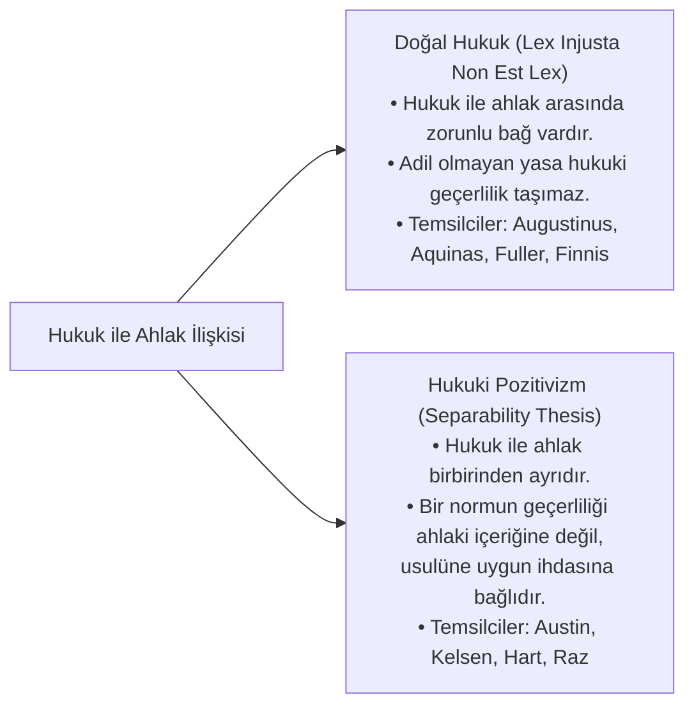
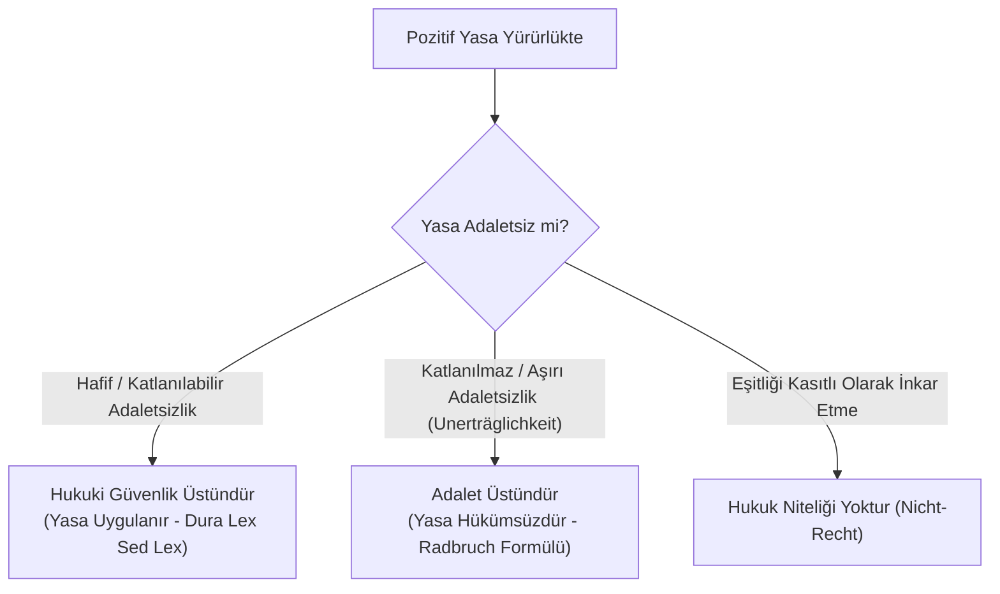
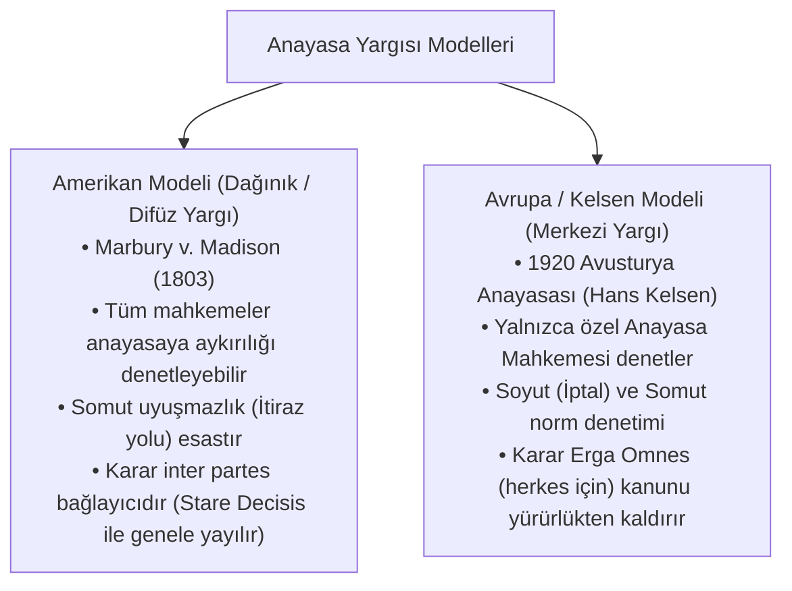
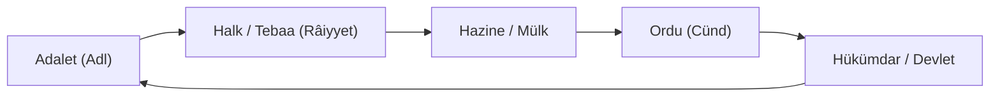
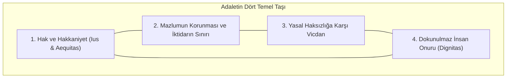

# Hukuk Kuramı, Adalet Felsefesi ve Yasal Düzen Kütüphanesi

<div align="center">

[](https://opensource.org/licenses/MIT)
[](#-3-kütüphane-ve-dizin-haritası)
[](#-4-tematik-modüllere-doğrudan-bağlantılar)
[](04-kaynakca-ve-okuma-listesi/kavramlar-ve-latince-hukuk-terimleri-sozlugu.md)
[](04-kaynakca-ve-okuma-listesi/adalet-ve-hukuk-aforizmalari-antolojisi.md)
[]()

<br/>

<p align="center">
  
</p>

**Hukuk Felsefesi • Pozitif Hukuk Kuramı • Anayasal Devlet Düzeni • Karşılaştırmalı Hukuk • Hukuk Sosyolojisi • Yapay Zekâ & Dijital Adalet • Türk Hukuk Tarihi • Uluslararası İnsan Hakları • Çevre Hukuku & Biyoetik • İnsancıl Hukuk & Barış Felsefesi • Hukuk Metodolojisi & Argümantasyon**

<br/>

[🧭 1. Epistemoloji](#-1-giriş-ve-epistemolojik-çerçeve-quid-ius) • [🔍 2. Doktrinler](#-2-kapsamlı-doktrin-ve-teori-İncelemeleri) • [🕊️ Adalet Ruhu](#g-adaletin-ruhu-ve-İnsanlık-vicdanı-tematik-alıntılar-ve-felsefi-bildiri) • [📚 3. Harita](#-3-kütüphane-ve-dizin-haritası) • [📂 4. Modüller](#-4-tematik-modüllere-doğrudan-bağlantılar) • [🧪 5. Web Portalı](#-5-İnteraktif-web-portalı-ve-muhakeme-simülatörü) • [⚖️ 6. Metodoloji](#⚖️-6-metodoloji-ve-akademik-standartlar) • [📖 7. Atıf](#-7-akademik-atıf-ve-kaynak-gösterme)

</div>

---

## 🏛️ Hukuk ve Adalet Üzerine Başlangıç Epigrafları

> *"Adalet mülkün temelidir. İstiklal, istikbal, hürriyet; her şey adaletle kaimdir."*  
> — **Gazi Mustafa Kemal Atatürk**, *Ankara Hukuk Mektebi Açılış Nutku (1925)*

> *"Adalet mülkün temelidir; hukukun bittiği yerde tiranlık başlar."*  
> — **John Locke**, *Hükümet Üzerine İkinci İnceleme (Second Treatise of Government, 1689)*

> *"Iustitia est constans et perpetua voluntas ius suum cuique tribuendi."*  
> *(Adalet, herkese hakkı olanı verme konusundaki değişmez ve sürekli iradedir.)*  
> — **Domitius Ulpianus**, *Digesta (1.1.10)*

> *"Hukuksuz ahlak güçsüzdür; ahlaksız hukuk ise canavardır."*  
> — **Aliya İzzetbegoviç**, *Doğu ve Batı Arasında İslam*

> *"Injustice anywhere is a threat to justice everywhere."*  
> *(Herhangi bir yerdeki adaletsizlik, her yerdeki adalete yönelmiş bir tehdittir.)*  
> — **Martin Luther King Jr.**, *Letter from Birmingham Jail (1963)*

> *"Memleket tutmak için çok asker lazımdır; askeri beslemek için mal ve servet lazımdır; serveti elde etmek için halkın zengin olması; halkın zengin olması için ise adil kanunlar lazımdır."*  
> — **Yusuf Has Hacib**, *Kutadgu Bilig (1069)*

> *"Devlet (mülk), küfürle durur ama zulümle durmaz."*  
> — **Nizamülmülk**, *Siyâsetnâme (1092)* & **İbn Haldun**, *Mukaddime (1377)*

> *"Bir tek kişiye yapılan haksızlık, bütün topluma yöneltilmiş bir tehdittir."*  
> — **Montesquieu**, *Kanunların Ruhu Üzerine (De l'esprit des lois, 1748)*

> *"Yasa koyucu adaleti bir yana bıraktığında; devlet, büyük bir haydut çetesinden başka nedir?"*  
> — **Aziz Augustinus**, *De Civitate Dei (Tanrı Devleti, IV. Kitap)*

> *"Pozitif yasa ile adalet arasındaki çelişki katlanılmaz bir boyuta ulaştığında, yasa adalet karşısında geri çekilmek zorundadır."*  
> — **Gustav Radbruch**, *Gesetzliches Unrecht und übergesetzliches Recht (1946)*

---

## 🧭 1. Giriş ve Epistemolojik Çerçeve: *Quid Ius?*

Immanuel Kant, *Saf Aklın Eleştirisi* ve *Ahlak Metafiziği: Hukuk Öğretisi (Rechtslehre)* eserlerinde hukukçuların karşılaştığı en temel açmazı şu meşhur soruyla özetler:

$$\text{"Noch suchen die Juristen eine Definition zu ihrem Begriffe von Recht."}$$
*(Hukukçular hâlâ kendi hukuk kavramlarının tanımını aramaktadırlar.)*

Kant'a göre bir hukukçunun yanıtlaması gereken iki ayrı soru düzlemi vardır:
1. **Quid Iuris? (Yürürlükteki Hukuk Nedir?):** Belirli bir zamanda ve mekânda pozitif kanunların neyi emrettiği, neyi yasakladığı veya izin verdiği meselesidir (*Pozitif Hukukun Alanı*).
2. **Quid Ius? (Hukukun Özü ve Hakkaniyet Nedir?):** Bir normun veya eylemin evrensel ahlaki ve rasyonel standartlar açısından **adil ve meşru** olup olmadığı meselesidir (*Hukuk Felsefesinin Alanı*).

```mermaid
flowchart TD
    subgraph Hukukun Üç Boyutlu Doğası (Dreidimensionale Rechtstheorie)
        A["1. Normatif Boyut (Geçerlilik / Sollen)<br>Kelsen, Austin, Hart"] <--> B["2. Olgusal / Sosyolojik Boyut (Etkililik / Sein)<br>Weber, Ehrlich, Holmes"]
        B <--> C["3. Aksiyolojik / Felsefi Boyut (Adalet / Değer)<br>Aristoteles, Radbruch, Rawls, Alexy"]
        C <--> A
    end
```

### Hukukun Aksiyolojik ve Mantıksal Temelleri:
* **Dağıtıcı Adalet Formülü (Aristoteles):** $\frac{\text{Kişi } A}{\text{Kişi } B} = \frac{\text{Pay } A}{\text{Pay } B}$ *(Geometrik Orantı / Hak Edişe Göre Bölüşüm)*
* **Düzeltici Adalet Formülü (Aristoteles):** $(A - x) + x = (B + x) - x$ *(Aritmetik Eşitlik / Haksız Fiilin Telafisi)*
* **Robert Alexy Ağırlık Formülü:** $W_{i,j} = \frac{I_i \cdot W_i \cdot R_i}{I_j \cdot W_j \cdot R_j}$ *(Temel Hak Çatışmalarında Rasyonel Tartma Testi)*
* **Kantçı Kategorik Buyruk:** *"Öyle hareket et ki, eyleminin ilkesi evrensel bir doğa yasası olabilsin; insanlığı asla salt bir araç değil, her zaman bir amaç olarak gör."*

---

## 🔍 2. Kapsamlı Doktrin ve Teori İncelemeleri

### A. Doğal Hukuk vs Hukuki Pozitivizm Antagonizması



#### Karşılaştırmalı Doktrin Matrisi:
| Parametre | Doğal Hukuk Geleneği (*Natural Law*) | Hukuki Pozitivizm (*Legal Positivism*) |
| :--- | :--- | :--- |
| **Geçerlilik Kriteri** | Evrensel adalet, insan doğası ve rasyonel ahlak normlarına uygunluk. | Yetkili organ tarafından usulüne uygun konulmuş olma (*Promulgation*). |
| **Hukuk-Ahlak Bağı** | **Zorunlu Bağlantı Tezi:** Ahlaka aykırı olan kural hukuk olamaz (*Augustinus, Aquinas, Fuller*). | **Ayrılabilirlik Tezi (*Separability*):** Hukukun mevcudiyeti ayrı, ahlaki liyakati ayrıdır (*Austin, Hart, Kelsen*). |
| **Yargıcın Rolü** | Pozitif norm adaletsizse hakkaniyete ve doğal hukuka başvurmalıdır. | Yargıç kişisel ahlaki inançlarını değil, konulmuş pozitif normu uygular. |
| **Tarihsel Kriz Noktası** | Rasyonel Aydınlanma ve II. Dünya Savaşı sonrası Nürnberg Mahkemeleri. | 19. yüzyıl Sanayi Devrimi ve modern ulus-devlet kodifikasyonları. |

---

### B. Radbruch Formülü ve Hukukun Sınırı

Gustav Radbruch, Nazi Almanyası deneyiminin ardından 1946 yılında kaleme aldığı *"Yasal Haksızlık ve Yasa Üstü Hukuk"* (*Gesetzliches Unrecht und übergesetzliches Recht*) makalesinde hukuki pozitivizmin çıkmazını şu formülle çözmüştür:

> *"Pozitif hukuk, içeriği bakımından adaletsiz ve amaca aykırı olsa bile, kanun olarak yürürlükte kaldığı sürece öncelikle uygulanmalıdır. Ancak pozitif yasa ile adalet arasındaki çelişki öyle **katlanılmaz bir düzeye (*unerträgliches Maß*)** ulaşırsa ki yasa 'adaletsiz hukuk' niteliğini aşarak **'yasal haksızlık' (*gesetzliches Unrecht*)** haline gelirse, o yasa adalet karşısında geri çekilmek zorundadır ve hukuk niteliğini kaybeder."*



---

### C. John Rawls: Hakkaniyet Olarak Adalet (*Justice as Fairness*)

John Rawls, 1971 tarihli başyapıtı *A Theory of Justice* ile faydacılığın (*utilitarianism*) "çoğunluğun mutluluğu için azınlığın haklarını feda etme" mantığını çürütmüş ve çağdaş liberal adalet teorisini inşa etmiştir:

1. **Bilinmezlik Peçesi (*Veil of Ignorance*):** Bireyler toplumdaki sınıflarını, ırklarını, cinsiyetlerini, zekâlarını ve servetlerini bilmedikleri varsayımsal bir **Başlangıç Durumunda (*Original Position*)** adalet ilkelerini seçerler.
2. **Birinci İlke (Eşit Temel Özgürlükler İlkesi):** Herkes en geniş temel özgürlükler sistemine eşit şekilde sahip olmalıdır.
3. **İkinci İlke (Sosyo-Ekonomik Eşitlikler):**
   * **Fırsat Eşitliği:** Konumlar ve makamlar herkese adil fırsat eşitliğiyle açık olmalıdır.
   * **Fark İlkesi (*Difference Principle*):** Toplumdaki ekonomik eşitsizlikler, ancak **toplumun en dezavantajlı kesiminin en yüksek yararına (*maximin*)** olacak şekilde düzenlendiğinde meşrudur.

---

### D. Ronald Dworkin ve Robert Alexy: Kurallar, İlkeler ve Ağırlık Formülü

Ronald Dworkin ve Robert Alexy, hukukun yalnızca açık "kurallardan" (*rules*) oluşmadığını, kuralların arkasında yatan **"ilkeler" (*principles*)** ve anayasal değerlerin de hukukun kurucu parçası olduğunu kanıtlamıştır:

* **Kural vs İlke:** Kurallar "ya hep ya hiç" (*all-or-nothing*) tarzında uygulanır. İlkeler ise birer **optimizasyon emri (*Optimierungsgebote*)** dir; somut olayda tartılırlar (*Balancing / Abwägung*).
* **Robert Alexy Ağırlık Modeli ($W_{i,j}$):**
  $$W_{i,j} = \frac{I_i \cdot W_i \cdot R_i}{I_j \cdot W_j \cdot R_j}$$
  Burada $I$ müdahale ağırlığını, $W$ anayasal soyut ağırlığı, $R$ olgusal gerekçenin kesinlik derecesini ifade eder.

---

<p align="center">
  
</p>

### E. Anayasa Yargısı ve Hukuk Devleti: İki Büyük Model



---

<p align="center">
  
</p>

### F. Türk Hukuk Mirası ve Dâire-i Adliye Sentezi

Türk devlet felsefesinde Kutadgu Bilig'den Tanzimat'a ve Cumhuriyet Hukuk Devrimi'ne uzanan çizgide adalet, devletin varlık sebebi kabul edilmiştir:



---

### G. Adaletin Ruhu ve İnsanlık Vicdanı: Tematik Alıntılar ve Felsefi Bildiri

<p align="center">
  
</p>

Hukuk kuralları cansız metinlerden ibaret değildir; onlara can veren, insanlık tarihinin ortak adalet ve vicdan hafızasıdır.



#### 📜 Tematik Özdeyişler ve Felsefi Yankılar:

* ⚖️ **Hakkaniyet ve Yasanın Katılığı:**  
  > *"Hakkaniyet (*epieikeia*), yasanın genelliği ve katılığından doğan adaletsizliği düzelten adalettir. Yasa soyuttur; hakkaniyet ise somut olayın vicdanıdır."*  
  > — **Aristoteles**, *Nikomakhos'a Etik (Ethica Nicomachea)*

* 🛡️ **Tiranlık ve Devletin Meşruiyeti:**  
  > *"Adaletin olmadığı yerde devlet nedir? Büyük bir haydut çetesinden (*magna latrocinia*) başka bir şey değildir!"*  
  > — **Aziz Augustinus**, *De Civitate Dei (Tanrı Devleti, IV. Kitap)*

* 🕊️ **Mazlumun Ahı ve Devletin Bekası:**  
  > *"Zulüm, medeniyetin ve imarın harabiyetidir (*el-Zulmü mü'zinün bi-harâbi'l-ümrân*). İnsanların hakkına, mülküne ve şerefine el uzatıldığı an devletin temelleri sarsılır."*  
  > — **İbn Haldun**, *Mukaddime (1377)*

* ⚔️ **Yasal Haksızlık ve Hukukçunun Sorumluluğu:**  
  > *"Yasa koyucu adaleti kasıtlı olarak inkâr ettiğinde, ortaya çıkan metin 'adaletsiz yasa' değil, 'yasal haksızlık'tır (*gesetzliches Unrecht*). Böyle bir metin hukuk niteliğini kaybeder ve ona itaat edilmez."*  
  > — **Gustav Radbruch**, *Yasal Haksızlık ve Yasa Üstü Hukuk (1946)*

* 🌟 **Adaletin Bölünmezliği:**  
  > *"Herhangi bir yerdeki adaletsizlik, her yerdeki adalete yönelmiş bir tehdittir (*Injustice anywhere is a threat to justice everywhere*)."*  
  > — **Martin Luther King Jr.**, *Birmingham Cezaevinden Mektup (1963)*

* 👑 **Hukukun Amacı Olarak Özgürlük:**  
  > *"Devletin nihai amacı tahakküm kurmak veya insanları korkutmak değildir; tam aksine, her bir insanı korkudan arındırarak bedenini ve zihnini özgürce kullanmasını sağlamaktır."*  
  > — **Baruch Spinoza**, *Tractatus Theologico-Politicus (1670)*

> 📖 *Antik Yunan'dan Roma'ya, Kutadgu Bilig'den Aydınlanma'ya, Atatürk'ten modern insan hakları bildirilerine kadar 100'ü aşkın alıntı ve felsefi inceleme için:*  
> **👉 [Adalet ve Hukuk Felsefesi Aforizmalar Antolojisi (2500 Yıllık Adalet Sesi)](04-kaynakca-ve-okuma-listesi/adalet-ve-hukuk-aforizmalari-antolojisi.md)**

---

<p align="center">
  
</p>

---

## 📚 3. Kütüphane ve Dizin Haritası

```text
hukuk-kurami-ve-adalet/
├── index.html                                          # İnteraktif Web Portalı, Canlı Arama ve Simülatör (Alexy & Fallacies)
├── assets/banners/                                     # Tematik Yüksek Çözünürlüklü Hukuk Bannerları
│   ├── banner_adalet_mulkun_temelidir.png
│   ├── banner_milli_hukuk_ve_adalet.png
│   ├── banner_adalet_ruhu.jpg
│   ├── banner_insan_haklari.jpg
│   ├── banner_dijital_adalet.jpg
│   └── banner_constitutional.svg
├── 01-felsefe-ve-kuram/                                # MODÜL 01: Hukuk Felsefesi ve Kuramı
│   ├── README.md
│   ├── dogal-hukuk-gelenegi/                           # Antik Dönem, Skolastik, Rasyonel, Radbruch
│   ├── pozitivizm-ve-normativizm/                      # Austin, Kelsen Grundnorm, Hart, Hukuki Realizm
│   └── adalet-teorileri/                               # Aristoteles, Bentham, Rawls, Nozick, Habermas
├── 02-kamu-ve-devlet-duzeni/                           # MODÜL 02: Kamu ve Anayasal Devlet Düzeni
│   ├── README.md
│   ├── anayasal-devlet-ve-egemenlik/                   # Egemenlik Evrimi, Anayasa Yargısı, İnsan Onuru
│   ├── kuvvetler-ayriligi/                             # Montesquieu, Hükümet Sistemleri, Yargı Bağımsızlığı
│   └── idarenin-hukukiligi/                            # Bağlı/Takdir Yetkisi, Güvenlik, İptal Sebepleri
├── 03-kavramlar-ve-doktrinler/                         # MODÜL 03: Temel Doktrinler, Usul & Mantık
│   ├── README.md
│   ├── normlar-hiyerarsisi.md                          # Stufenbaulehre & Antinomi Kuralları
│   ├── hukuki-yorumsal-yontemler.md                    # Hermeneutik, Lafzi, Teleolojik, A Fortiori
│   ├── hukuk-boslugu-ve-hakimin-hukuk-yaratmasi.md     # TMK m. 1/2 & Teleolojik İndirgeme
│   ├── hak-kavrami-ve-turleri.md                       # Hohfeld Hak Matrisi & Yenilik Doğuran Haklar
│   ├── hukukta-nedensellik-ve-sorumluluk.md            # Uygun İlliyet & Kusursuz Sorumluluk
│   ├── olcululuk-ve-belirlilik.md                      # Elverişlilik, Gereklilik, Orantılılık
│   ├── tabii-hakim-ilkesi.md                           # Kanuni Hâkim Güvencesi
│   ├── masumiyet-karinesi-ve-lehe-kanun.md             # Presumption of Innocence & Lex Mitior
│   ├── ceza-hukukunun-evrensel-ilkeleri.md             # Nullum Crimen, In Dubio Pro Reo, Ne Bis In Idem
│   └── hakkin-kotuye-kullanilmasi-ve-durustluk-kurali.md # TMK m. 2 & Venire Contra Factum Proprium
├── 04-kaynakca-ve-okuma-listesi/                       # MODÜL 04: Literatür, İçtihat, Brocard & Aforizmalar
│   ├── README.md
│   ├── klasik-metinler.md                              # Antikçağ & Aydınlanma Temel Metinleri
│   ├── modern-literatur.md                             # Çağdaş Hukuk Monografileri & Makaleler
│   ├── ictihat-ve-emsal-kararlar.md                    # AİHM, BVerfG, ABD Supreme Court, AYM, Danıştay, Yargıtay
│   ├── kavramlar-ve-latince-hukuk-terimleri-sozlugu.md # Brocardica Juridica (100+ Latince Kural & Çeviri)
│   └── adalet-ve-hukuk-aforizmalari-antolojisi.md      # 2500 Yıllık Adalet Sesi: 100+ Felsefi Aforizma & Alıntı
├── 05-karsilastirmali-hukuk-ve-sistemler/              # MODÜL 05: Karşılaştırmalı Hukuk Düzenleri
│   ├── README.md
│   ├── kita-avrupasi-ve-ortak-hukuk-karsilastirmasi.md # Civil Law vs Common Law & Stare Decisis
│   ├── dini-ve-geleneksel-hukuk-sistemleri.md          # Fıkıh, Halaha, Doğu Asya & Ubuntu
│   ├── uluslarustu-ve-kuresel-hukuk-duzenleri.md       # AB Hukuku, Jus Cogens, Lex Mercatoria
│   └── gecis-donemi-adaleti-ve-yuzlesme.md             # Hakikat Komisyonları & Lustration
├── 06-hukuk-sosyolojisi-ve-elestirel-yaklasimlar/      # MODÜL 06: Sosyoloji & Eleştirel Teori
│   ├── README.md
│   ├── hukuk-sosyolojisinin-temelleri.md               # Ehrlich Yaşayan Hukuk, Weber, Durkheim, Pound
│   ├── elestirel-hukuk-calismalari-ve-postmodernizm.md # CLS Hareketi, Indeterminacy, Foucault
│   ├── feminist-hukuk-teorisi-ve-toplumsal-cinsiyet.md # MacKinnon, Bakım Etiği, Kesişimsellik
│   └── hukuk-ve-iktisat-ekolu.md                       # Coase Teoremi, Posner, Kaldor-Hicks
├── 07-dijital-cag-yapay-zeka-ve-hukukun-gelecegi/      # MODÜL 07: Yapay Zekâ & Dijital Hukuk
│   ├── README.md
│   ├── yapay-zeka-ve-hukuki-kisilik-sorunu.md          # E-Personhood, AI Act Risk Piramidi
│   ├── algoritmik-adalet-ve-yargisal-otomasyon.md      # COMPAS Vakası, CEPEJ Şartı, Tahminleyici Yargı
│   ├── dijital-haklar-veri-egemenligi-ve-mahremiyet.md # GDPR, KVKK, Unutulma Hakkı, Nörohukuk
│   └── akilli-sozlesmeler-ve-merkeziyetsiz-hukuk.md    # Code is Law, DAO Hukuku, Blokzincir Tahkimi
├── 08-turk-hukuk-tarihi-ve-anayasal-evrim/             # MODÜL 08: Türk Hukuk Tarihi ve Cumhuriyet Devrimi
│   ├── README.md
│   ├── 01-eski-turk-toresi-ve-islam-hukuku-sentezi.md  # Kutadgu Bilig, Kanunnameler, Kadılık ve Dâire-i Adliye
│   ├── 02-tanzimat-ve-kanunilestirme-mecelle.md        # Tanzimat (1839), Kanun-i Esasi (1876), Mecelle 99 Kaide
│   ├── 03-cumhuriyet-hukuk-devrimi-ve-laiklesme.md     # 1926 Medeni Kanun İktibası, Laik Hukuk, Eşitlik
│   └── 04-turk-anayasa-yargisi-ve-demokratiklesme-tarihi.md # 1961-1982 Anayasaları, AYM ve Bireysel Başvuru
├── 09-insan-haklari-ve-uluslararasi-yargi/             # MODÜL 09: Uluslararası İnsan Hakları ve Yargı
│   ├── README.md
│   ├── 01-aihs-ve-avrupa-insan-haklari-mahkemesi-sistemi.md # AİHS, Subsidiarite, Takdir Marjı, Yaşayan Belge
│   ├── 02-adil-yargilanma-hakki-ve-usuli-guvenceler.md # AİHS Madde 6, Silahların Eşitliği, Salduz İlkesi
│   ├── 03-insan-haklari-ihlallerinde-yargisal-telafi-ve-pilot-karar.md # Pilot Karar, İade-i Muhakeme, Tazminat
│   └── 04-uluslararasi-ceza-adaleti-ve-insanliga-karsi-suclar.md # Roma Statüsü, UCM/ICC, Evrensel Yargı Yetkisi
├── 10-cevre-hukuku-ve-biyoetik/                        # MODÜL 10: Ekolojik Hukuk Devleti ve Biyoetik
│   ├── README.md
│   ├── 01-iklim-adaleti-ve-gelecek-nesillere-sorumluluk.md # Hans Jonas, Urgenda & Neubauer Emsal Kararları
│   ├── 02-eko-merkezci-hukuk-ve-dogaya-kisilik-taninmasi.md # Christopher Stone, Pachamama, Nehir Kişiliği
│   └── 03-biyoetik-genetik-hukuk-ve-insan-onuru.md     # CRISPR, Oviedo Biyoetik Sözleşmesi, Ötenazi & Onam
├── 11-insancil-hukuk-savas-ve-baris/                   # MODÜL 11: Uluslararası İnsancıl Hukuk & Barış Felsefesi
│   ├── README.md
│   ├── 01-cenevre-sozlesmeleri-ve-silahli-catismalar-hukuku.md # Cenevre Dörtlüsü, Ek Protokoller, Martens Klozu
│   ├── 02-asimetrik-savas-siber-harb-ve-otonom-silahlar.md # LAWS, Anlamlı İnsan Kontrolü, Tallinn Manueli
│   ├── 03-hibrit-tehditler-ve-insani-mudahale-doktrini.md # R2P, Koruma Sorumluluğu, BM Vetosu Krizi
│   └── 04-ebedi-baris-felsefesi-kant-ve-kuresel-guvenlik.md # Kant Zum ewigen Frieden, Kozmopolit Hukuk
└── 12-hukuk-metodolojisi-ve-argumantasyon/             # MODÜL 12: Hukuk Mantığı, Argümantasyon & Alexy
    ├── README.md
    ├── 01-hukuk-mantigi-ve-tullesim-kurali-syllogism.md # Justizsyllogismus, Kıyas, Mefhum-u Muhalif, A Fortiori
    ├── 02-alexy-argumantasyon-kurami-ve-soylem-analizi.md # Sonderfallthese, İç ve Dış Gerekçelendirme Standartları
    ├── 03-agirlik-formulu-ve-haklar-dengesi-weight-formula.md # W_i,j Tartma Modeli, Optimizasyon Emirleri
    └── 04-hukuki-yanilsamalar-ve-safsatalar-fallacies.md # Petitio Principii, Ad Hominem, Straw Man, Ad Populum
```

---

## 🧭 4. Tematik Modüllere Doğrudan Bağlantılar

### [01. Felsefe ve Kuram](01-felsefe-ve-kuram/README.md)
* **Doğal Hukuk:** [Antikçağ & Stoa](01-felsefe-ve-kuram/dogal-hukuk-gelenegi/antik-donem-ve-stoa.md) | [Skolastik Hukuk](01-felsefe-ve-kuram/dogal-hukuk-gelenegi/orta-cag-ve-skolastik.md) | [Rasyonel Doğal Hukuk](01-felsefe-ve-kuram/dogal-hukuk-gelenegi/rasyonel-dogal-hukuk.md) | [Radbruch Formülü](01-felsefe-ve-kuram/dogal-hukuk-gelenegi/radbruch-formulu-ve-modern-donus.md)
* **Pozitivizm & Normativizm:** [Bentham & Austin Buyruk Teorisi](01-felsefe-ve-kuram/pozitivizm-ve-normativizm/erken-pozitivizm-ve-buyruk-teorisi.md) | [Kelsen Saf Hukuk Kuramı](01-felsefe-ve-kuram/pozitivizm-ve-normativizm/saf-hukuk-kurami-kelsen.md) | [H.L.A. Hart Hukuk Kavramı](01-felsefe-ve-kuram/pozitivizm-ve-normativizm/hart-hukuk-kavrami.md) | [Hukuki Realizm & CLS](01-felsefe-ve-kuram/pozitivizm-ve-normativizm/hukuki-realizm-ve-elestirel-hukuk.md)
* **Adalet Kuramları:** [Dağıtıcı & Düzeltici Adalet](01-felsefe-ve-kuram/adalet-teorileri/dagitici-ve-duzeltici-adalet.md) | [Faydacılık](01-felsefe-ve-kuram/adalet-teorileri/faydacilik-ve-adalet.md) | [Rawls: Hakkaniyet Olarak Adalet](01-felsefe-ve-kuram/adalet-teorileri/rawls-hakkaniyet-olarak-adalet.md) | [Nozick: Yetkilenme Kuramı](01-felsefe-ve-kuram/adalet-teorileri/nozick-ve-liberteryen-adalet.md) | [Habermas: Müzakereci Demokrasi](01-felsefe-ve-kuram/adalet-teorileri/habermas-ve-muzakereci-demokrasi.md) | [Komüniter Eleştiri](01-felsefe-ve-kuram/adalet-teorileri/sandeller-ve-komuniter-elestiri.md)

### [02. Kamu ve Devlet Düzeni](02-kamu-ve-devlet-duzeni/README.md)
* **Anayasal Devlet:** [Egemenliğin Evrimi](02-kamu-ve-devlet-duzeni/anayasal-devlet-ve-egemenlik/egemenlik-kavraminin-evrimi.md) | [Anayasa Yargısı & Denetim Modelleri](02-kamu-ve-devlet-duzeni/anayasal-devlet-ve-egemenlik/anayasa-ustunlugu-ve-yargisal-denetim.md) | [İnsan Onuru & Temel Haklar](02-kamu-ve-devlet-duzeni/anayasal-devlet-ve-egemenlik/temel-haklar-ve-insan-onuru.md)
* **Kuvvetler Ayrılığı:** [Montesquieu & Fren-Denge](02-kamu-ve-devlet-duzeni/kuvvetler-ayriligi/montesquieu-ve-fren-denge-sistemi.md) | [Hükümet Sistemleri](02-kamu-ve-devlet-duzeni/kuvvetler-ayriligi/hukumet-sistemleri-ve-erkler-iliskisi.md) | [Yargı Bağımsızlığı & Güvencesi](02-kamu-ve-devlet-duzeni/kuvvetler-ayriligi/yargi-bagimsizligi-ve-tarafsizligi.md)
* **İdarenin Hukukiliği:** [Bağlı Yetki & Takdir Yetkisi](02-kamu-ve-devlet-duzeni/idarenin-hukukiligi/kanuni-idare-ve-bagli-yetki-takdir-yetkisi.md) | [Hukuki Güvenlik & Kazanılmış Haklar](02-kamu-ve-devlet-duzeni/idarenin-hukukiligi/hukuki-guvenlik-ve-kazanilmis-haklar.md) | [İdari İşlemlerin İptal Sebepleri](02-kamu-ve-devlet-duzeni/idarenin-hukukiligi/idari-islemlerin-iptal-sebepleri.md)

### [03. Temel Kavramlar ve Doktrinler](03-kavramlar-ve-doktrinler/README.md)
* [Normlar Hiyerarşisi (Stufenbaulehre)](03-kavramlar-ve-doktrinler/normlar-hiyerarsisi.md)
* [Hukuki Yorum Yöntemleri ve Mantıksal Çıkarımlar (Hermeneutik)](03-kavramlar-ve-doktrinler/hukuki-yorumsal-yontemler.md)
* [Hukuk Boşluğu ve Hâkimin Hukuk Yaratması](03-kavramlar-ve-doktrinler/hukuk-boslugu-ve-hakimin-hukuk-yaratmasi.md)
* [Hak Kavramı ve Hohfeldian Haklar Analizi](03-kavramlar-ve-doktrinler/hak-kavrami-ve-turleri.md)
* [Hukukta Nedensellik ve Sorumluluk Kuramları](03-kavramlar-ve-doktrinler/hukukta-nedensellik-ve-sorumluluk.md)
* [Ölçülülük ve Hukuki Belirlilik Doktrini](03-kavramlar-ve-doktrinler/olcululuk-ve-belirlilik.md)
* [Tabii Hâkim (Kanuni Hâkim) İlkesi](03-kavramlar-ve-doktrinler/tabii-hakim-ilkesi.md)
* [Masumiyet Karinesi ve Lehe Kanunun Geriye Yürümesi](03-kavramlar-ve-doktrinler/masumiyet-karinesi-ve-lehe-kanun.md)
* [Ceza Hukukunun Evrensel İlkeleri](03-kavramlar-ve-doktrinler/ceza-hukukunun-evrensel-ilkeleri.md)
* [Dürüstlük Kuralı ve Hakkın Kötüye Kullanılması Yasağı](03-kavramlar-ve-doktrinler/hakkin-kotuye-kullanilmasi-ve-durustluk-kurali.md)

### [04. Kaynakça, Literatür ve Sözlük](04-kaynakca-ve-okuma-listesi/README.md)
* [Klasik Metinler ve Çeviriler](04-kaynakca-ve-okuma-listesi/klasik-metinler.md)
* [Modern Literatür ve Makaleler](04-kaynakca-ve-okuma-listesi/modern-literatur.md)
* [Emsal Yüksek Mahkeme Kararları (AİHM, BVerfG, ABD Supreme Court, AYM, Danıştay, Yargıtay)](04-kaynakca-ve-okuma-listesi/ictihat-ve-emsal-kararlar.md)
* [Latince Hukuk Özdeyişleri ve Terimler Sözlüğü (Brocardica Juridica - 100+ Brocard)](04-kaynakca-ve-okuma-listesi/kavramlar-ve-latince-hukuk-terimleri-sozlugu.md)
* [Adalet ve Hukuk Aforizmaları Antolojisi (2500 Yıllık Adalet Sesi - 100+ Aforizma)](04-kaynakca-ve-okuma-listesi/adalet-ve-hukuk-aforizmalari-antolojisi.md)

### [05. Karşılaştırmalı Hukuk ve Sistemler](05-karsilastirmali-hukuk-ve-sistemler/README.md)
* [Kıta Avrupası (*Civil Law*) ve Ortak Hukuk (*Common Law*) Karşılaştırması](05-karsilastirmali-hukuk-ve-sistemler/kita-avrupasi-ve-ortak-hukuk-karsilastirmasi.md)
* [Dini ve Geleneksel Hukuk Sistemleri (Fıkıh, Halaha, Doğu Asya, Ubuntu)](05-karsilastirmali-hukuk-ve-sistemler/dini-ve-geleneksel-hukuk-sistemleri.md)
* [Uluslarüstü ve Küresel Hukuk Düzenleri (AB Hukuku, Jus Cogens, Lex Mercatoria)](05-karsilastirmali-hukuk-ve-sistemler/uluslarustu-ve-kuresel-hukuk-duzenleri.md)
* [Geçiş Dönemi Adaleti ve Tarihsel Yüzleşme (Hakikat Komisyonları & Arınma)](05-karsilastirmali-hukuk-ve-sistemler/gecis-donemi-adaleti-ve-yuzlesme.md)

### [06. Hukuk Sosyolojisi ve Eleştirel Yaklaşımlar](06-hukuk-sosyolojisi-ve-elestirel-yaklasimlar/README.md)
* [Hukuk Sosyolojisinin Temelleri: Yaşayan Hukuk (Ehrlich, Weber, Durkheim, Pound)](06-hukuk-sosyolojisi-ve-elestirel-yaklasimlar/hukuk-sosyolojisinin-temelleri.md)
* [Eleştirel Hukuk Çalışmaları (*CLS*) ve Postmodernizm (Kennedy, Unger, Foucault)](06-hukuk-sosyolojisi-ve-elestirel-yaklasimlar/elestirel-hukuk-calismalari-ve-postmodernizm.md)
* [Feminist Hukuk Teorisi ve Toplumsal Cinsiyet Adaleti (MacKinnon, Crenshaw)](06-hukuk-sosyolojisi-ve-elestirel-yaklasimlar/feminist-hukuk-teorisi-ve-toplumsal-cinsiyet.md)
* [Hukuk ve İktisat Ekolü (*Law and Economics* - Coase, Posner, Calabresi)](06-hukuk-sosyolojisi-ve-elestirel-yaklasimlar/hukuk-ve-iktisat-ekolu.md)

### [07. Dijital Çağ, Yapay Zekâ ve Hukukun Geleceği](07-dijital-cag-yapay-zeka-ve-hukukun-gelecegi/README.md)
* [Yapay Zekâ, Otonom Sistemler ve Hukuki Kişilik Sorunu (AB AI Act)](07-dijital-cag-yapay-zeka-ve-hukukun-gelecegi/yapay-zeka-ve-hukuki-kisilik-sorunu.md)
* [Algoritmik Adalet, Yargısal Otomasyon ve Tahminleyici Yargı (COMPAS & CEPEJ)](07-dijital-cag-yapay-zeka-ve-hukukun-gelecegi/algoritmik-adalet-ve-yargisal-otomasyon.md)
* [Dijital Haklar, Veri Egemenliği ve Mahremiyet (GDPR, KVKK, Unutulma Hakkı)](07-dijital-cag-yapay-zeka-ve-hukukun-gelecegi/dijital-haklar-veri-egemenligi-ve-mahremiyet.md)
* [Akıllı Sözleşmeler, Blokzincir ve Merkeziyetsiz Hukuk (Code is Law & DAO)](07-dijital-cag-yapay-zeka-ve-hukukun-gelecegi/akilli-sozlesmeler-ve-merkeziyetsiz-hukuk.md)

### [08. Türk Hukuk Tarihi, Tanzimat ve Cumhuriyet Devrimi](08-turk-hukuk-tarihi-ve-anayasal-evrim/README.md)
* [Eski Türk Töresi ve İslam Hukuku Sentezi (Kutadgu Bilig, Kanunnameler, Dâire-i Adliye)](08-turk-hukuk-tarihi-ve-anayasal-evrim/01-eski-turk-toresi-ve-islam-hukuku-sentezi.md)
* [Tanzimat Fermanı (1839), Kanun-i Esâsî (1876) ve Mecelle-i Ahkâm-ı Adliye](08-turk-hukuk-tarihi-ve-anayasal-evrim/02-tanzimat-ve-kanunilestirme-mecelle.md)
* [Cumhuriyet Hukuk Devrimi, Medeni Kanun İktibası ve Laik Hukuk Nizamı](08-turk-hukuk-tarihi-ve-anayasal-evrim/03-cumhuriyet-hukuk-devrimi-ve-laiklesme.md)
* [Türk Anayasa Yargısı, AYM ve Bireysel Başvuru Rejimi](08-turk-hukuk-tarihi-ve-anayasal-evrim/04-turk-anayasa-yargisi-ve-demokratiklesme-tarihi.md)

### [09. Uluslararası İnsan Hakları ve Yargısal Koruma](09-insan-haklari-ve-uluslararasi-yargi/README.md)
* [AİHS ve Avrupa İnsan Hakları Mahkemesi Sistemi (Subsidiarite & Takdir Marjı)](09-insan-haklari-ve-uluslararasi-yargi/01-aihs-ve-avrupa-insan-haklari-mahkemesi-sistemi.md)
* [Adil Yargılanma Hakkı ve Usuli Güvenceler (AİHS Madde 6 & Salduz Kuralı)](09-insan-haklari-ve-uluslararasi-yargi/02-adil-yargilanma-hakki-ve-usuli-guvenceler.md)
* [İnsan Hakları İhlallerinde Yargısal Telafi, Pilot Karar ve İade-i Muhakeme](09-insan-haklari-ve-uluslararasi-yargi/03-insan-haklari-ihlallerinde-yargisal-telafi-ve-pilot-karar.md)
* [Uluslararası Ceza Adaleti, Roma Statüsü ve İnsanlığa Karşı Suçlar (UCM/ICC)](09-insan-haklari-ve-uluslararasi-yargi/04-uluslararasi-ceza-adaleti-ve-insanliga-karsi-suclar.md)

### [10. Çevre Hukuku, Gelecek Nesiller ve Biyoetik](10-cevre-hukuku-ve-biyoetik/README.md)
* [İklim Adaleti, Gelecek Nesiller ve Anayasal Yükümlülükler (Hans Jonas & Neubauer)](10-cevre-hukuku-ve-biyoetik/01-iklim-adaleti-ve-gelecek-nesillere-sorumluluk.md)
* [Eko-Merkezci Hukuk Kuramı ve Doğaya Tüzel Kişilik Tanınması (Whanganui & Pachamama)](10-cevre-hukuku-ve-biyoetik/02-eko-merkezci-hukuk-ve-dogaya-kisilik-taninmasi.md)
* [Biyoetik Hukuku, Genetik Müdahaleler ve İnsan Onuru (CRISPR & Oviedo)](10-cevre-hukuku-ve-biyoetik/03-biyoetik-genetik-hukuk-ve-insan-onuru.md)

### [11. Uluslararası İnsancıl Hukuk ve Barış Felsefesi](11-insancil-hukuk-savas-ve-baris/README.md)
* [Cenevre Sözleşmeleri ve Silahlı Çatışmalar Hukuku (Ius in Bello & Martens Klozu)](11-insancil-hukuk-savas-ve-baris/01-cenevre-sozlesmeleri-ve-silahli-catismalar-hukuku.md)
* [Asimetrik Savaş, Siber Harp ve Otonom Silahlar (LAWS & Tallinn Manueli)](11-insancil-hukuk-savas-ve-baris/02-asimetrik-savas-siber-harb-ve-otonom-silahlar.md)
* [Hibrit Tehditler ve Koruma Sorumluluğu (R2P & Haklı Savaş Teorisi)](11-insancil-hukuk-savas-ve-baris/03-hibrit-tehditler-ve-insani-mudahale-doktrini.md)
* [Ebedi Barış Felsefesi (Kant) ve Küresel Güvenlik (Zum ewigen Frieden)](11-insancil-hukuk-savas-ve-baris/04-ebedi-baris-felsefesi-kant-ve-kuresel-guvenlik.md)

### [12. Hukuk Metodolojisi, Mantık ve Argümantasyon](12-hukuk-metodolojisi-ve-argumantasyon/README.md)
* [Hukuk Mantığı ve Yargısal Tasım (Justizsyllogismus, Kıyas & Mefhum-u Muhalif)](12-hukuk-metodolojisi-ve-argumantasyon/01-hukuk-mantigi-ve-tullesim-kurali-syllogism.md)
* [Robert Alexy Argümantasyon Kuramı ve Söylem Analizi (Sonderfallthese & Haklılık)](12-hukuk-metodolojisi-ve-argumantasyon/02-alexy-argumantasyon-kurami-ve-soylem-analizi.md)
* [Ağırlık Formülü ve Haklar Dengesi (Weight Formula W_i,j Tartma Testi)](12-hukuk-metodolojisi-ve-argumantasyon/03-agirlik-formulu-ve-haklar-dengesi-weight-formula.md)
* [Hukuki Yanılsamalar ve Mantıksal Safsatalar (Fallacies in Legal Reasoning)](12-hukuk-metodolojisi-ve-argumantasyon/04-hukuki-yanilsamalar-ve-safsatalar-fallacies.md)

---

## 🧪 5. İnteraktif Web Portalı ve Muhakeme Simülatörü

Projenin kök dizininde yer alan **[`index.html`](index.html)** web uygulaması, akademik içerikleri etkileşimli deneyimlere dönüştüren bir dijital hukuk laboratuvarıdır:

1. **⚖️ Radbruch Formülü Test İstasyonu:** Bir yasanın katlanılmaz adaletsizlik veya eşitliği kasten inkâr derecesini anlık olarak test eden interaktif algoritma.
2. **🧮 Robert Alexy Ağırlık Formülü Simülatörü ($W_{i,j}$):** Temel hak çatışmalarında (Örn: Basın Özgürlüğü vs Kişilik Hakları) müdahale yoğunluğu ($I$), soyut anayasal ağırlık ($W$) ve ampirik güvenilirlik ($R$) parametreleriyle matematiksel tartma hesabı.
3. **🛡️ 3 Aşamalı Ölçülülük Simülatörü:** AYM ve AİHM kriterlerinde *Elverişlilik*, *Gereklilik* ve *Orantılılık* adımlarını kontrol eden interaktif denetim aracı.
4. **🚫 Hukuki Safsata (Fallacy) Teşhis Aracı:** Dava dilekçelerinde ve kararlarda yapılan *Petitio Principii*, *Ad Hominem*, *Straw Man*, *Ad Ignorantiam* ve *Post Hoc* mantık kusurlarını örneklerle analiz eden tanı motoru.
5. **📜 Latince Brocard Kartları (Flashcards):** 100'ü aşkın evrensel hukuk ilkesini Türkçe meali ve içtihadi bağlamıyla sunan interaktif kart destesi.
6. **🕊️ Adalet Aforizmaları & Filozoflar Galerisi:** 2500 yıllık adalet seslerini kategoriye göre listeleyen, rastgele getiren ve panoya kopyalayan felsefi galeri.
7. **🔍 Canlı İndeks ve Hibrit Arama Motoru:** 55+ akademik doktrin belgesini başlık, özet ve etiketlere göre milisaniyelik gecikmeyle filtreleyen arama çubuğu.

---

## ⚖️ 6. Metodoloji ve Akademik Standartlar

1. **Kavramsal ve Doktriner Derinlik:** Hukuki kavramlar hem tarihsel-felsefi kökenleri hem de pozitif hukuk uygulamasındaki pratik sonuçları itibarıyla açıklanır.
2. **Karşılaştırmalı Perspektif:** Kıta Avrupası Hukuku (*Civil Law*), Ortak Hukuk (*Common Law*), Uluslararası İnsancıl Hukuk ve Doğu/İslam geleneklerinin adalet kavrayışları mukayese edilir.
3. **Doktrin - İçtihat Bütünlüğü:** Soyut felsefi ilkeler; AYM, AİHM, Danıştay, Yargıtay ve uluslararası mahkemelerin emsal kararlarıyla desteklenir.
4. **Geleceğin Hukuku ve Dijital Adalet:** Yapay zekâ, veri mahremiyeti, blokzincir, otonom silahlar ve biyoetik insan onuru ve anayasal standartlar ışığında ele alınır.
5. **Açık ve Evrensel Bilgi:** Hukukun üstünlüğü, kanun önünde eşitlik, keyfiyetin önlenmesi ve insan haysiyeti gayesine hizmet eden açık kaynak dokümantasyon sunulur.

---

## 📖 7. Akademik Atıf ve Kaynak Gösterme

Bu kütüphanedeki makale, inceleme ve doktriner şemaları akademik çalışmalarınızda, tezlerinizde veya ders notlarınızda kullanırken aşağıdaki formatları tercih edebilirsiniz:

### APA 7 Formatı:
```text
Iuris Prudentia. (2026). Hukuk Kuramı, Adalet Felsefesi ve Yasal Düzen Kütüphanesi (Sürüm 2.5). 
GitHub. https://github.com/arch-yunus/hukuk-kurami-ve-adalet
```

### BibTeX Formatı:
```bibtex
@misc{iurisprudentia2026,
  author = {Yunus Emre and Contributors},
  title = {Iuris Prudentia: Hukuk Kuramı, Adalet Felsefesi ve Yasal Düzen Kütüphanesi},
  year = {2026},
  publisher = {GitHub},
  howpublished = {\url{https://github.com/arch-yunus/hukuk-kurami-ve-adalet}},
  note = {Açık Kaynak Hukuk, Adalet ve Argümantasyon Dokümantasyonu}
}
```

---

<div align="center">

*Hukukun üstünlüğü, adil yargılanma hakkı, kanun önünde mutlak eşitlik ve insan onurunun korunması adına açık kaynak akademik başvuru kütüphanesi.*

**[🌐 İnteraktif Bilgi Portalını Başlat (index.html)](index.html)** • **[🕊️ Adalet Aforizmaları Antolojisi](04-kaynakca-ve-okuma-listesi/adalet-ve-hukuk-aforizmalari-antolojisi.md)** • **[📜 Latince Sözlük](04-kaynakca-ve-okuma-listesi/kavramlar-ve-latince-hukuk-terimleri-sozlugu.md)**

</div>